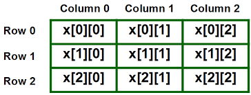
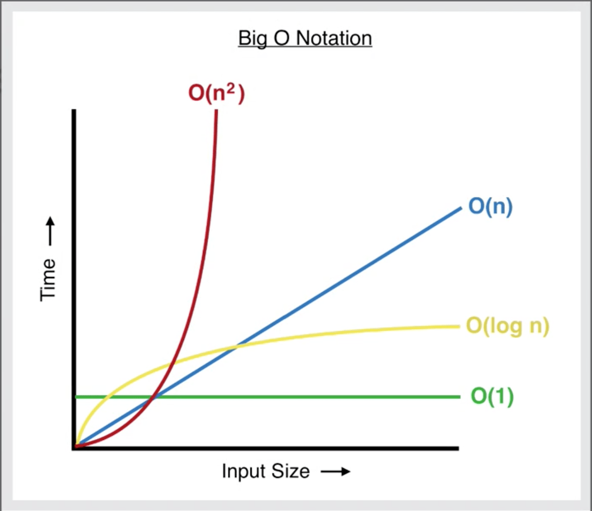
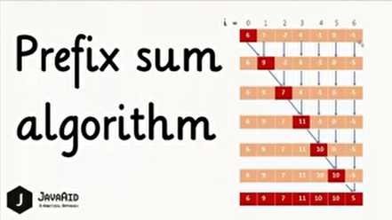

# Array

- If we want to take 10 integers from the user:
  - In normal, we will think to create 10 integer variables.
  - **But** If we want to take 1000 integers from the user, it looks so boring.
  - **So** in C++ there's something will help us in that called **Arrays**.
- It's a series of elements of the _same type_ placed in contiguous memory locations that can be individually referenced by adding an index to a unique identifier.

## Declaring Arrays:
- Like a regular variable, an array must be declared before it is used.
- A typical declaration of an array in C++ is:
  ```c++
  // DataType Name [Number of elements];
  int x[5];
  ```
- Initializing arrays:
  ```c++
  int x[5] = {1, 2, 3, 4, 5};
  // OR
  int y[] = {10, 20, 30, 40, 50}; // Size of array will be 5.
  ```

## Accessing the Values of an Array:
- Code:
  ```c++
  #include <iostream>
  using namespace std;

  int main() {
      int x[1000];

      x[0] = 4;
      x[1] = 8 + x[0];

      x[2] = x[0] * x[1];

      int y = x[0];

      cout << x[0] << '\n'; // 4
      cout << x[1] << '\n'; // 12
      cout << x[2] << '\n'; // 48
      cout << y << '\n';    // 4

      return 0;
  }
  ```

## Accessing the Values of an Array Using Loops:
- Code:
  ```c++
  int x[10];
  for (int i = 0; i < size(x); ++i) {
      cin >> x[i];
  }

  for (int i = 0; i < size(x); ++i) {
      cout << x[i] << ' ';
  }
  ```

## Problems
1) Write a program to take N numbers from the user and print the summation.
   - Solution:
     ```c++
     int n, sum = 0;
     cin >> n;
     int arr[n];
     for (int i = 0; i < n; ++i) {
         cin >> arr[i];
         sum += arr[i];
     }
     cout << "Summation = " << sum;
     ```
2) Write a program that takes an array of size N from user and number X, then check if X exists in the array or not.
   - Solution:
     ```c++
     int n, x;
     cin >> n;
     int arr[n];
     for (int i = 0; i < n; ++i) {
         cin >> arr[i];
     }

     cin >> x;
     bool exists = false;
     for (int i = 0; i < n; ++i) {
         if (arr[i] == x) {
            exists = true;
         break;
         }
     }
     string result = (exists) ? to_string(x) + " exists in the array." : to_string(x) + " doesn't exist in the array";
     cout << result;
     ```
3) Write a program that takes 10 numbers from user and print largest and smallest numbers.
    - Solution:
      ```c++
      int smallest = 2e9, largest = -2e9, arr[10];
      for (int i = 0; i < size(arr); ++i) {
          cin >> arr[i];
      }

      for (int i = 0; i < size(arr); ++i) {
          if (arr[i] > largest) {
              largest = arr[i];
          }
      
          if (arr[i] < smallest) {
             smallest = arr[i];
          }
      }

      cout << "Largest number = " << largest << '\n';
      cout << "Smallest number = " << smallest << '\n';
      ```
4) Write a program that takes an array of size N from user, then if number is even change its value to 0, otherwise to 1 then print the array.
   - Solution:
     ```c++
     int n;
     cin >> n;
     int arr[n];

     for (int i = 0; i < n; ++i) {
         cin >> arr[i];
         arr[i] = (arr[i] % 2 == 0) ? 0 : 1;
         cout << arr[i] << ' ';
     }
     ```

## Array of Char Declaring and Initializing
- Code:
  ```c++
  #include <iostream>
  using namespace std;

  int main() {
      char name1[4];
      name1[0] = 'H';
      name1[1] = 'i';
      name1[2] = '!';

      char name2[4] = {'H', 'i', '!'};
      // char name2[4] = {'H', 'i', '!', '\0'};
      char name3[4] = "Hi!";
      char name4[4];

      for (int i = 0; i < 3; ++i) {
          cin >> name4[i];
      }

      char name5[4];
      cin >> name5;

      cout << name1 << ' ' << name2 << ' ' << name3 << ' ' << name4 << ' ' << name5;

      return 0;
  }
  ```

## Problem
- Write a program that takes an array of chars of size N from user, then convert every char that is upper to lower and every char that is lower to upper.
   - Solution:
     ```c++
     #include <iostream>
     using namespace std;

     char txt[100005];

     int main() {
         int n;
         cin >> n;
    
         for (int i = 0; i < n; ++i) {
             cin >> txt[i];
             if (txt[i] >= 65 && txt[i] <= 90) {
                 cout << char(txt[i] + 32);
             } else if (txt[i] >= 97 && txt[i] <= 122) {
                 cout << char(txt[i] - 32);
             }
         }

         return 0;
     }
     ```

## 2D Array
- Multidimensional arrays can be described as "Arrays of arrays" and it's like matrix.
    
- Code:
  ```c++
  #include <iostream>
  using namespace std;

  int a[2][3];

  int main() {
      int x[2][3] = {
          {1, 2, 3},
          {4 ,5, 6}
      };

      for (int i = 0; i < 2; ++i) {
          for (int j = 0; j < 3; ++j) {
              cout << x[i][j] << ' ';
          }
          cout << '\n';
      }

      return 0;
  }
  ```

## Problem
- Write a program that takes a 2d array from user and prints the largest and smallest number in each row.
  - Solution:
    ```c++
    #include <iostream>
    using namespace std;

    int a[100005][100005];

    int main() {
        int x, y;
        cin >> x >> y;

        for (int i = 0; i < x; ++i) {
            int smallest = 2e9, largest = -2e9;
            for (int j = 0; j < y; ++j) {
                cin >> a[i][j];
                if (a[i][j] > largest)
                    largest = a[i][j];
                if (a[i][j] < smallest)
                smallest = a[i][j];
            }
            cout << "Largest in row " << i << " = " << largest << '\n';
            cout << "Smallest in row " << i << " = " << smallest << '\n';
        }

        return 0;
    }
    ```

## Sub-array
- A subarray is contiguous part of array (consecutive positions).
- For example, the subarrays of array {1, 2, 3} are:
  - {1}
  - {1, 2}
  - {1, 2, 3}
  - {2}
  - {2, 3}
  - {3}
- For any array of size n, there are n * (n + 1) / 2 non-empty subarrays.
- **How to generate all subarrays?**
  - We can run three nested loops, the first loop picks a starting element, the second loop picks the ending element of subarray, and the third loop we can print the subarray or do anything on it.
  - Code:
    ```c++
    #include <iostream>
    using namespace std;

    int x[100];

    int main() {
        int n;
        cin >> n;

        for (int i = 0; i < n; ++i) {
            cin >> x[i];
        }

        for (int i = 0; i < n; ++i) {
            for (int j = i; j < n; ++j) {
                cout << "Subarray form " << i << " to " << j << " : ";
                for (int k = i; k <= j; ++k) {
                    cout << x[k] << ' ';
                }
                cout << '\n';
            }
        }

        return 0;
    }
    ```

## Problem
- Find the maximum subarray sum with length (k = 3).
  - Ex: 11 -8 16 -7 24 -2 3
  - Solution 1:
    ```c++
    #include <iostream>
    using namespace std;

    int x[100], sum[100];

    int main() {
        int n;
        cin >> n;

        for (int i = 0; i < n; ++i) {
            cin >> x[i];
        }

        for (int i = 0; i < n; ++i) {
            for (int j = i; j < n; ++j) {
                if (j - i + 1 == 3) {
                    for (int k = i; k <= j; ++k) {
                        sum[i] += x[k];
                    }
                }
            }
        }

        int maxi = -2e9;
        for (int i = 0; i < n; ++i) {
            if (sum[i] > maxi) {
                maxi = sum[i];
            }
        }

        cout << "Maximum number of subarray with lenght = 3 is: " << maxi;

        return 0;
    }
    ```
  - Solution 2:
    ```c++
    #include <iostream>
    using namespace std;

    int x[100];

    int main() {
        int n, k = 3;
        cin >> n;

        for (int i = 0; i < n; ++i) {
            cin >> x[i];
        }

        long long sum = 0, maxi = -2e9;

        for (int i = 0; i < k; ++i) {
            sum += x[i];
        }

        for (int i = k; i < n; ++i) {
            sum -= x[i - k];
            sum += x[i];
            if (sum > maxi) {
                maxi = sum;
            }
        }

        cout << "Maximum number of subarray with lenght = 3 is: " << maxi;

        return 0;
    }
    ```

## Subsequence
- A subsequence is a sequence that can be derived from another sequence by deleting zero or more elements, without changing the order of the remaining elements.
- For example:
  - Subsequences of the sequence {1, 2, 3, 4} are:
    - {1}
    - {2}
    - {3}
    - {4}
    - {1, 2}
    - {1, 3}
    - {1, 4}
    - {2 ,3}
    - {2 ,4}
    - {3, 4}
    - {1, 2, 3}
    - {1, 2, 4}
    - {1, 3, 4}
    - {2, 3, 4}
    - {1, 2, 3, 4}
- More generally, we can say that for a sequence of size n, we have ((2 ^ n) -1) non-empty subsequences in total.

## Problem
- Given 2 arrays, check if the second array is a subsequence of the first one.
  - Solution:
    ```c++
    #include <iostream>
    using namespace std;

    const int N = 10005;
    int arr1[N], arr2[N];

    int main() {
        int n, m;
        cin >> n >> m;

        for (int i = 0; i < n; ++i) {
            cin >> arr1[i];
        }
        for (int i = 0; i < m; ++i) {
            cin >> arr2[i];
        }

        int idx = 0; // arr1
        bool found = false;
        for (int i = 0; i < m; ++i) { // arr2
            found = false;
            while (idx < n) {
                if (arr2[i] == arr1[idx]) {
                    idx++;
                    found = true;
                    break;
                }
                idx++;
            }
            if (!found) {
                cout << "NO";
                return 0;
            }
        }

        cout << "YES";
        return 0;
    }
    ```

## Complexity
- Algorithmic complexity is concerned about how fast or slow particular algorithms perform.
1. Time complexity:
   - Time complexity of an algorithm quantifies the amount of time taken by an algorithm to run as a function of the size of input.
2. Space complexity:
   - Space complexity of an algorithm quantifies the amount of space or memory taken by an algorithm to run as a function of the size of input.

## O-Notation [ O() ]
- Big O notation is used in CS to describe the complexity of an algorithm.
- Big O specifically describes the **worst-case** scenario, and can be used to describe the execution time required or the space used.
1. Arithmetic operations:
    ```c++
    int x = 2, y = 3, z;
    z = x + y; // constant time
    ```
   - Time complexity = O(1).
   - Space complexity = O(1).
2. Accessing any array element:
   ```c++
   const int N = 3;
   int arr[N] = {2, 4 ,6}, x;
   x = arr[1];
   ```
   - Time complexity = O(1).
   - Space complexity = O(N).
- **O(N)** describes an algorithm whose performance will grow **linearly** and in direct proportion to the size of the input data.
  ```c++
  const int N = 4;
  int arr[N] = {1, 2, 3, 4}, sum = 0;
  for (int i = 0; i < N; ++i) {
       sum += arr[i];
  }
  ```
  - Time complexity = O(N). (loop)
  - Space complexity = O(N). (array)
- **O(N^2)** represents an algorithm whose performance is directly proportional to the square of the size of the input data.
  - This is common with algorithm that involves nested iterations over the data.
  - Deeper-nested iterations will result in O(N^3), O(N^4), etc...
  ```c++
  int arr[N][N], sum = 0;
  for (int i = 0; i < N; ++i) {
      for (int j = 0; j < N; ++j) {
          sum += arr[i][j];
      }
  }
  ```
  - Time complexity = O(N^2).
  - Space complexity = O(N^2).
- **O(log(N))** finding an item in a stored array with a binary search or balanced search tree, which means splitting the input into 2 equal halves (decrease the search space by half in each iteration).
  ```c++
  int N, cnt = 0;
  cin >> N;
  while (N > 1) {
     cnt++;
     N /= 2;
  }
  ```
  - Time complexity = O(log(N)).
  - Space complexity = O(1).
- 

## Prefix Array
- 
- Given an array arr[] of size n, its prefix sum array is another array prefixSum[] of the same size such that the value of prefixSum[i] is arr[0] + arr[1] + arr[2] ... arr[i].
  ```text
  Input: arr[] = {10, 20, 10, 5, 15}
  Output: prefixSum = {10, 30, 40, 45, 60}
  
  Explanation: While traversing the array, update the element by adding it with its previous element.
  prefixSum[0] = 10,
  prefixSum[1] = prefixSum[0] + arr[1] = 30,
  prefixSum[2] = prefixSum[1] + arr[2] = 40 and so on.
  ```
- [Problem](https://codeforces.com/group/MWSDmqGsZm/contest/219774/problem/Y)
- Solution:
  ```c++
  #include <iomanip>
  #include <iostream>
  using namespace std;

  const int N = 1e5+5;
  int n, q;
  int arr[N];
  long long pre[N];

  int main()
  {
      ios_base::sync_with_stdio(0);
      cin.tie(0);
      cout.tie(0);

      cin >> n >> q;

      // pre[i] = arr[i] + pre[i - 1];
      for (int i = 1; i <= n; ++i) {
          cin >> arr[i];
      }
      pre[1] = arr[1];
      for (int i = 2; i <= n; ++i) {
          pre[i] = arr[i] + pre[i - 1];
      }

      int l, r;
      long long sum = 0;

      /*
       * L R
       * 1   cout << pre[R];
       * n   cout << pre[R] - pre[L - 1];
       */

      while (q--) {
          cin >> l >> r;
          // for (int j = l; j <= r; ++j) {
          //     sum += arr[j];
          // }
          cout << pre[r] - pre[l - 1] << '\n';
      }

      return 0;
  }
  ```

## Frequency Array
- [Problem](https://codeforces.com/group/MWSDmqGsZm/contest/219774/problem/V)
- Solution:
  ```c++
  #include <iostream>
  using namespace std;

  int n, m;
  const int N = 1e5+5;
  int arr[N];
  int freq[N];

  int main()
  {
      ios_base::sync_with_stdio(0); cin.tie(0); cout.tie(0);

      cin >> n >> m;
      for (int i = 0; i < n; ++i) {
          cin >> arr[i];
          int x = arr[i];
          freq[x]++;
      }
      for (int i = 1; i <= m; ++i) {
          cout << freq[i] << '\n';
      }

      return 0;
  }
  ```

## Sorting
- There are some functions defined before in the libraries of the compiler called built-in functions.
- One of them is the function **sort**.
- It sorts the elements in ascending order.
- Sort functions have different forms.
- They are defined in a library called "algorithm" which you have to include before calling the function.
- This function doesn't return anything, so it's a void function.
- Code:
  ```c++
  #include <iostream>
  #include <algorithm>
  using namespace std;

  int n;
  const int N = 1e5+5;
  int arr[N];

  int main()
  {
      ios_base::sync_with_stdio(0); cin.tie(0); cout.tie(0);

      cin >> n;
      for (int i = 0; i < n; ++i) {
          cin >> arr[i];
      }
      sort(arr, arr + n);
      // ascending
      for (int i = 0; i < n; ++i) {
          cout << arr[i] << ' ';
      }
      reverse(arr, arr + n);
      cout << '\n';
      // descending
      for (int i = 0; i < n; ++i) {
          cout << arr[i] << ' ';
      }

      return 0;
  }
  ```
