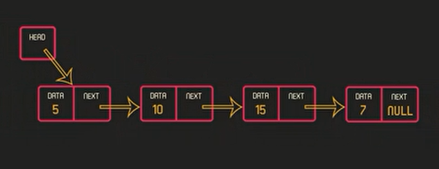

# Linked List

## Linked List vs Array
| Linked List                                             | Array                                            |
|---------------------------------------------------------|--------------------------------------------------|
| Flexible size.                                          | Fixed size.                                      |
| Easy to add on or delete from.                          | Hard to add on or delete from.                   |
| Not essential to take sequential addresses from memory. | Takes sequential addresses on memory.            |
| Time to access elements on it is slow and varies.       | Time to access elements on it is fast and fixed. |

## How to Store in Linked List
- Every element in the linked list has two values:
  - The element's value.
  - and pointer (points on the next element).
- Every element is called **node**.
- The pointer that points the first element is called **head**.
- 

## Insert Node
```c++
#include <iostream>
using namespace std;

struct node {
    int data;
    node* next;
};

node* head = nullptr;

void insertNode(int value);

int main() {
    insertNode(5);
    insertNode(10);
    insertNode(15);
    insertNode(20);
    
    return 0;
}

void insertNode(int value) {
    node* new_node = new node;
    new_node->data = value;

    if (head == nullptr) {
        head = new_node;
        new_node->next = nullptr;
    } else {
        node* last = head;
        while (last->next != nullptr) {
            last = last->next;
        }
        last->next = new_node;
        new_node->next = nullptr;
    }
}
```

## Display Linked List
```c++
void display() {
    if (head == nullptr) {
        cout << "The linked list is empty.\n";
    } else {
        node* current_node = head;
        while (current_node != nullptr) {
            cout << current_node->data << '\t';
            current_node = current_node->next;
        }
    }
    cout << '\n';
}
```

## Delete Node
```c++
void deleteNode(int value) {
    node* current = head, *previous = head;

    if (current->data == value) {
        current = current->next;
        free(current);
        return;
    }

    while (current->data != value) {
        previous = current;
        current = current->next;
    }
    previous->next = current->next;
    free(current);
}
```

## Insert Beginning
```c++
void insertBeginning(int value) {
    node* new_node = new node;
    new_node->data = value;

    new_node->next = head;
    head = new_node;
}
```

## Delete Beginning
```c++
void deleteBeginning() {
    if (head == nullptr) {
        cout << "The linked list is empty.\n";
    } else {
        node* first_node = head;
        head = first_node->next;
        delete(first_node);
    }
}
```

## Delete End
```c++
void deleteEnd() {
    if (head == nullptr) {
        cout << "The linked list is empty.\n";
    } else if (head->next == nullptr) {
        delete(head);
        head = nullptr;
    } else {
        node* ptr = head;
        while (ptr->next->next != nullptr) {
            ptr = ptr->next;
        }
        delete(ptr->next);
        ptr->next = nullptr;
    }
}
```

## Code
[Linked List All Code](linked_list.cpp)
