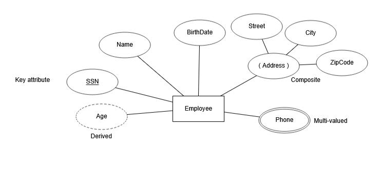
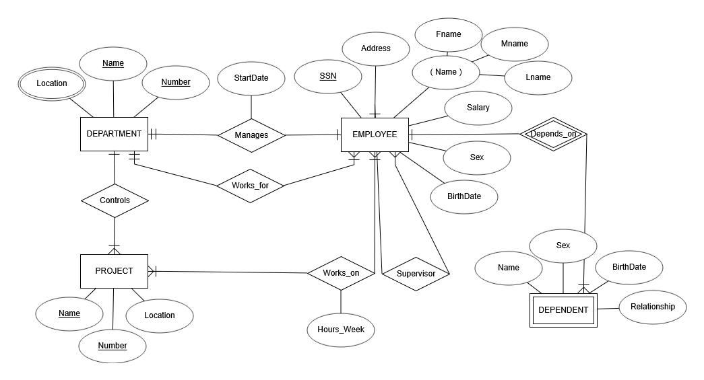

# Chapter 3 - Data Modeling Using Entity Relationship Model - ERD

## ER Model Concepts
- Entities and Attributes:
  - **Entities** are specific persons, places, events, objects in the user environment about which the user needs to keep data.
    - For example, _the Employee, Office, Task, Conference_.
  - **Attributes** are properties used to describe an entity.
    - For example, an EMPLOYEE entity may have the attributes: _Name, SSN, Address, Sex, BirthDate_.

- Relationships:
  - A **relationship** relates two or more distinct entities with a specific meaning.
    - For example, 
      - EMPLOYEE John _works on_ the ProductX PROJECT
      - OR,
      - EMPLOYEE Franklin _manages_ the Research DEPARTMENT.

## Types of Attributes
- Simple:
  - Each entity has a single atomic value for the attribute.
  - For example, SSN or Sex.
- Composite:
  - The attribute may be composed of several components.
  - For example,
    - Address (Apt#, House#, Street, City, State, ZipCode, Country).
    - Name (FirstName, MiddleName, LastName).
  - Composition may form a hierarchy where some components are themselves composite.
- Single-valued:
  - An entity that has a single value of the attribute.
  - For example, SSN or Sex.
- Multi-valued:
  - An entity may have multiple valued for the attribute.
  - For example, 
    - Color of a CAR.
    - PreviousDegree of Person.
  - Donated as {Color} or {PreviousDegree}.
- Stored:
  - The attribute value is taken from the user.
  - For example, Salary or Bonus.
- Derived:
  - The attribute value is calculated depending on other attributes' values.
  - For example, NetSalary (Salary + Bonus).
- Complex:
  - Composite + Multi-valued.
  - For example, Phone:
    - Composite ⇒ consists of (country code, government code, phone number).
    - Multi-valued ⇒ one person can have more than one number.

## Represent Entity and Attribute in ER Model
- Entity:
  - Rectangle ⇒ strong.
  - Double rectangle ⇒ weak.
    - An entity that doesn't have a key and depends on another entity.
    - For example,
      - Dependent
        - attributes ⇒ Name, Sex, Age ⇒ can't be a key.
        - depends on another entity (Employee).
- Attribute:
  - Oval ⇒ simple, single, stored.
  - Oval with () ⇒ composite.
  - Double oval ⇒ multi-valued.
  - Dashed oval ⇒ derived.
- Example,
  - 

## Relationships
- A **relationship** relates two or more distinct entities with a specific meaning.
  - For example,
    - EMPLOYEE John _works on_ the ProductX PROJECT
    - OR,
    - EMPLOYEE Franklin _manages_ the Research DEPARTMENT.
- Represented by a **diamond**.

## Relationships Types
1) Degree:
   - The degree of a relationship type is the number of participating entity types.
     1. binary ⇒ both MANAGES and WORKS_ON (two entities).
     2. ternary ⇒ between three entities. For example, _supply_ relationship between (Project, Supplier, Part) entities.
     3. unary (recursive relationship) ⇒ between the entity and itself. For example, Worker _supervise_ another Worker.
2) Cardinality:
   1. One-to-One:
      - Each entity in the relationship will have exactly one related entity.
      - For example, 
        - One Employee can manage one Department.
        - One Department is managed by one Employee.
   2. One-to-Many:
      - An entity on one side of the relationship can have many related entities, but an entity on the other side will have a maximum of one related entity.
      - For example,
        - One Department manages many Projects.
        - One Project is managed by one Department.
   3. Many-to-Many:
      - Entities on both sides of the relationship have many related entities on the other side.
      - For example,
        - One Employee works on many Projects
        - AND
        - One Project is worked by many Employees.

## Constraints on Relationships
- Also known as _ratio constraints_.
- Cardinality ratio (specifies _maximum_ participation):
  - One-to-One (1:1).
  - One-to-Many (1:N) or Many-to-One (N:1).
  - Many-to-Many (M:N).
- Existence Dependency Constraint (specifies _minimum_ participation) (also called participation constraint)
  - Zero (optional/partial participation, not existence-dependant).
    - Represented by a _single_ line.
  - One or more (mandatory/total participation, existence-dependant).
    - Represented by _double_ line.
  - For example, 
    - Not every Employee should manage a Department (partial).
    - Each Department should be managed by an Employee (total).

## Alternative (min, max) Notation for Relationship Structural Constraints
- Specified on each participation of an entity type E in a relationship type R.
- Specifies that each entity e in E participates in at least _min_ and at most _max_ relationship instances in R.
- Default (no constraints): min = 0, max = n (signifying no limit).
- Must have min <= max, min >= 0, max >= 1.
- Derived from the knowledge of mini-world constraints.
- Examples:
  - A department has exactly one manager, and an employee can manage at most one department.
    - Specify (0, 1) for the participation of EMPLOYEE in MANAGES.
    - Specify (1, 1) for the participation of DEPARTMENT in MANAGES.
  - An employee can work for exactly one department, and one department can have any number of employees.
    - Specify (1, 1) for the participation of EMPLOYEE in DEPARTMENT.
    - Specify (1, n) for the participation of DEPARTMENT in DEPARTMENT WORKS_FOR.

## Example COMPANY Database
- We need to create a database schema based on the following (simplified) requirements of the COMPANY database:
  - The company is organized into DEPARTMENTs:
    - Each department has a 
      - unique name, 
      - unique number, 
      - and an employee who _manages_ the department.
    - We keep track of the start date of the department manager.
    - A department may have several locations.
  - Each department _controls_ a number of PROJECTs:
    - Each project has a
      - unique name,
      - unique number,
      - and is located into a single location.
  - We store each EMPLOYEE's 
    - social security number (SSN), 
    - address,
    - salary,
    - sex,
    - birthdate.
    - Each employee _works for_ one department but may _work on_ several projects.
    - We keep track of the number of hours per week that an employee currently works on each project.
    - We also keep track of the _direct supervisor_ of each employee.
  - Each employee may have a number of DEPENDENTs.
    - For each dependent, we keep track of their
      - name,
      - sex,
      - birthdate,
      - and relationship to the employee.
- Solution: 
  - 
