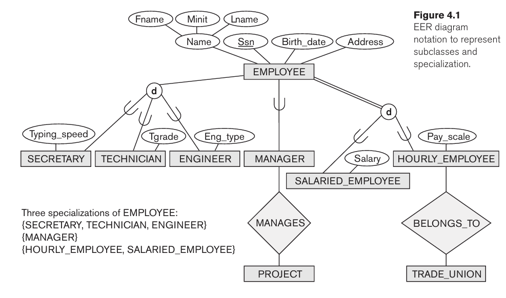
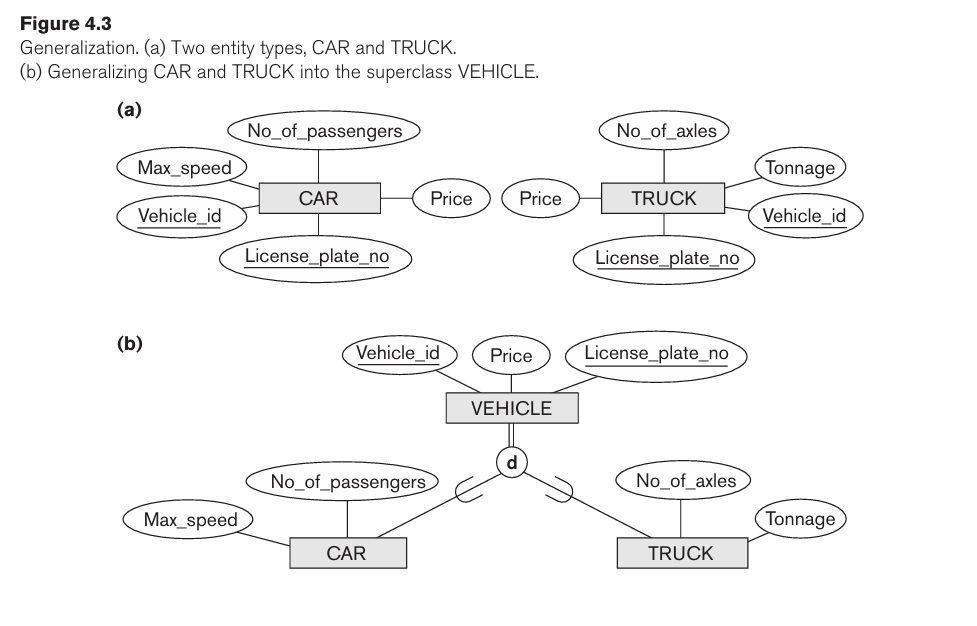
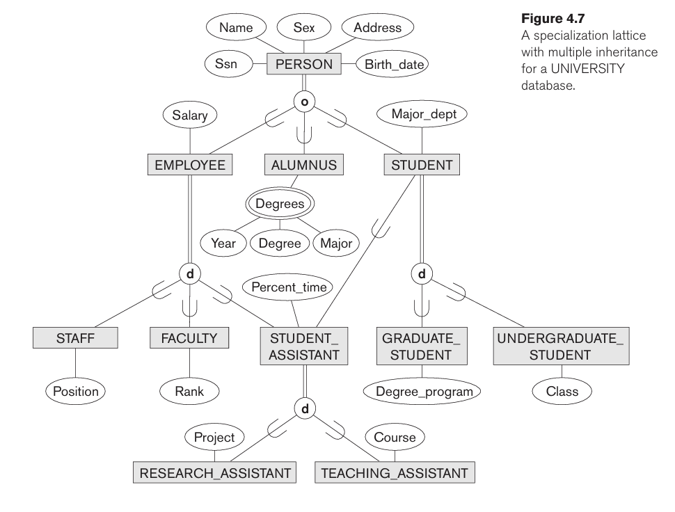
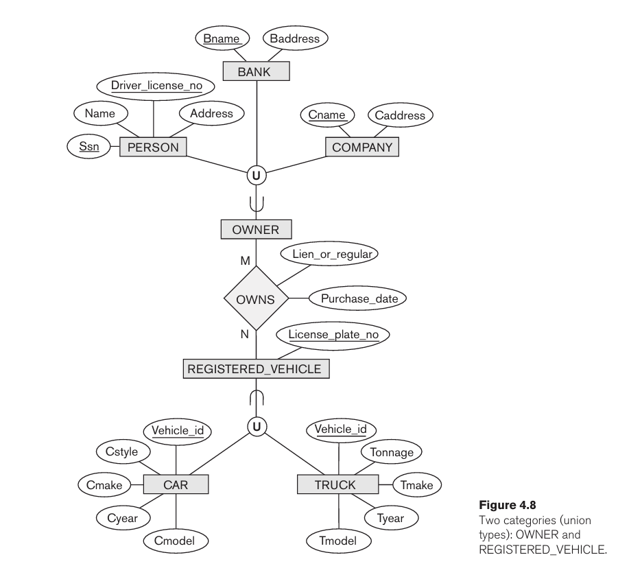
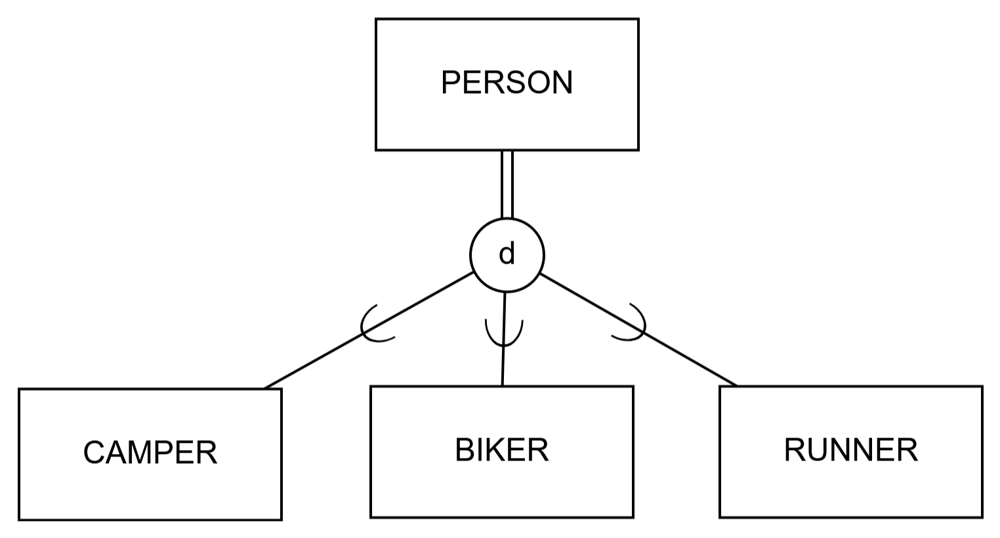
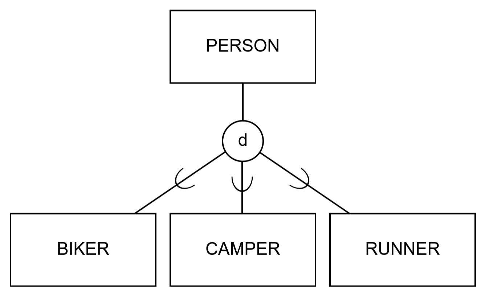
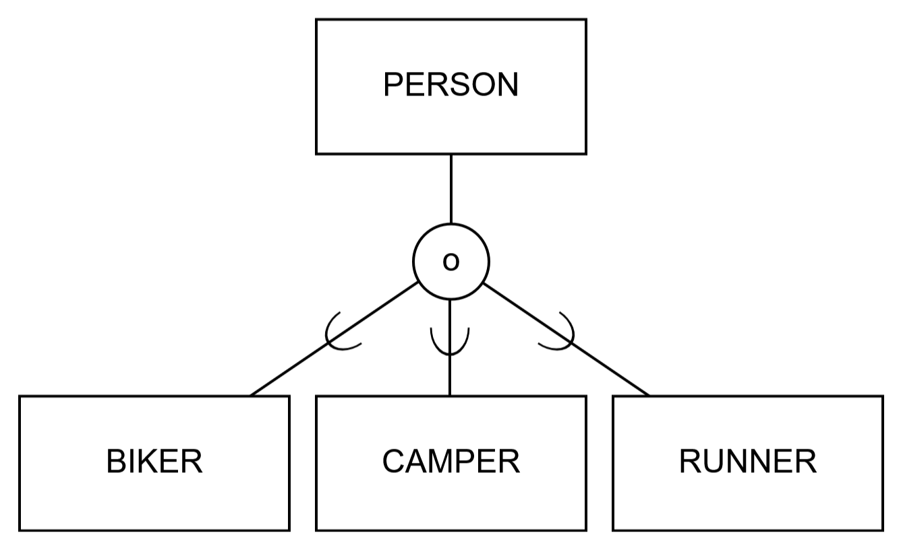
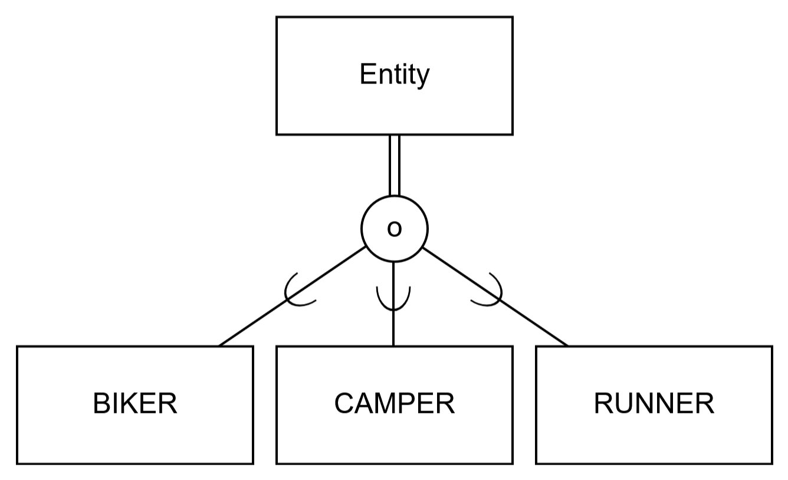
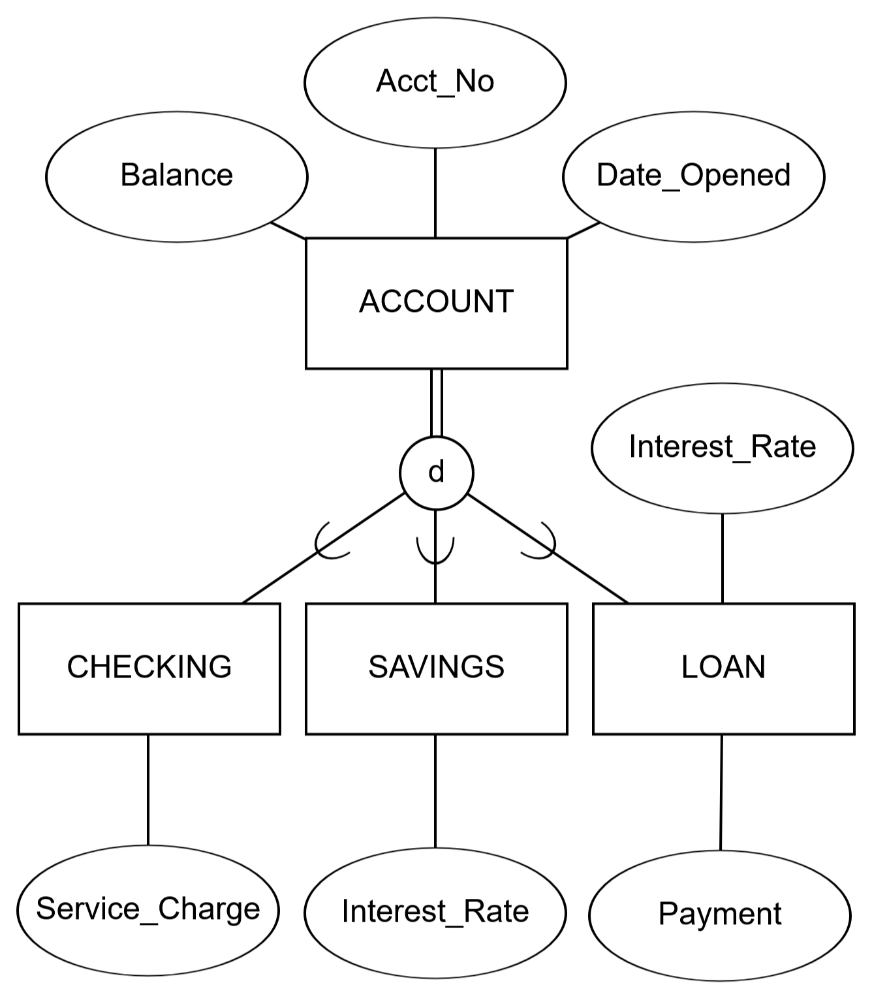

# Chapter 4 - Enhanced Entity Relationship Model - EER

- EER stands for Enhanced ER or Extended ER.
- EER Mode Concepts:
  - Includes all modeling concepts of basic ER.
  - Additional concepts:
    - subclasses/superclasses.
    - specialization/generalization.
    - categories (UNION types).
    - attribute and relationship inheritance.
- The additional EER concepts are used to model applications more completely and more accurate.
  - EER includes some object-oriented concepts like inheritance.

## Subclasses and Superclasses
- An entity is defined by the attributes it possesses and the relationship types in which it participates.
- In many cases, an entity type has different subgroups of its entities that are meaningful and need to be represented explicitly.
- We call each of these subgroups a **subclass** of the entity type.
- and the entity type is called **superclass**.
- Subclass inherits all attributes and relationships from the superclass.
- **Example**: EMPLOYEE entity may be further grouped into:
  - SECRETARY, ENGINEER, TECHNICIAN, ...
    - based on the EMPLOYEE's job.
  - Manager
    - EMPLOYEEs who are managers.
  - SALARIED_EMPLOYEE, HOURLY_EMPLOYEE
    - based on the EMPLOYEE's method of pay.
- 
  - Typing_speed is called a **local attribute**.
- A member of the superclass can be optionally included as a member of any number of its subclasses.
  - Examples:
    - A salaried employee who is also an engineer belongs to the two subclasses:
      - ENGINEER, and
      - SALARIED_EMPLOYEE.
    - A salaried employee who is also an engineering manager belongs to the three subclasses:
      - MANAGER,
      - ENGINEER, and
      - SALARIED_EMPLOYEE.
- It's not necessary that every entity in a superclass be a member of some subclass.

## Specialization
- Specialization is the process of defining a set of subclasses of a superclass.
- There are two main reasons for including class/subclass relationships and specializations in a data model.
  - The **first** 
    - is that certain attributes may apply to some but not all entities of the superclass.
    - a subclass is defined in order to group the entities to which these attributes apply.
  - The second is that:
    - some relationship types may be participated in only by entities that are members of the subclass.

## Generalization
- Generalization is the reverse of the specialization.
- Several classes with common features are generalized into a subclass:
  - original classes become its subclasses.
- Example: CAR, TRUCK generalized into VEHICLE:
  - both CAR and TRUCK become subclasses of the superclass VEHICLE.
  - We can view {CAR, TRUCK} as a specialization of VEHICLE.
  - Alternatively, we can view VEHICLE as a generalization of CAR and TRUCK.
- 

## Constraints on Specialization and Generalization
- Two basic constraints can apply to specialization and generalization:
  1. Disjointness Constraint:
     - Specifies that the subclasses of the specialization must be disjoint:
       - an entity can be a member of at most one of the subclasses of the specialization.
       - Specified by _d_ in EER diagram.
     - If not disjoint, specialization is _overlapping_:
       - that is the same entity may be a member of more than one subclass of the specialization.
       - Specified by _o_ in EER diagram.
  2. Completeness Constraint:
    - _Total_ specifies that every entity in the superclass must be a member of some subclass in the specialization/generalization.
      - Shown in EER diagrams by a **double line**.
    - _Partial_ allows an entity not to belong to any of the subclasses.
      - Shown in EER diagrams by a **single line**.

## Specialization/Generalization Hierarchies, Lattices, and Shared Subclasses
- A subclass may itself have further subclass specified on it.
  - forms a hierarchy or a lattice.
- **Hierarchy**:
  - Hierarchy has a constraint that every subclass has only one superclass (called **single inheritance**). 
  - This is basically a **tree structure**.
- In a **lattice**:
  - A subclass can be a subclass of more than one superclass (called **multiple inheritance**).
- 

## Categories (UNION Types)
- All the _superclass/subclass relationships_ we have seen thus before have a single superclass.
- A shared superclass is a subclass in:
  - _more than one_ distinct superclass/subclass relationships.
  - each relationship has a single superclass.
  - shared subclass leads to multiple inheritance.
- In some cases, we need to model a _single superclass/subclass relationship_ with _more than one_ superclass.
- Superclasses can represent different entity types.
- Such a subclass is called a category of UNION.
- 

## Examples
1. At a weekend retreat, the entity type PERSON has three subtypes: CAMPER, BIKER, and RUNNER. Draw a separate EER diagram segment for each of the following situations:
   1. At a given time, a person must be exactly one of these subtypes.
      - 
   2. A person may or may not be one of these subtypes. However, a person who is one of those subtypes cannot at the same time be one of the other subtypes.
      - 
   3. A person may or may not be one of these subtypes. On the other hand, a person may be any two (or even three) of these subtypes at the same time.
      - 
   4. At a given time, a person must be at least one of these subtypes.
      - 
2. A bank has three types of accounts: checking, savings, and loan. 
   - Following are the attributes for each type of accounts:
      - CHECKING: Acct_No, Date_Opened, Balance, _Service_Charge.
      - SAVINGS: Acct_No, Date_Opened, Balance, _Interest_Rate.
      - LOAN: Acct_No, Date_Opened, Balance, Interest_Rate, Payment.
   - Assume that each bank account must be a member of exactly one of these subtypes.
   - Using generalization, develop an EER model segment to represent this situation using the traditional EER notation.
   - 
