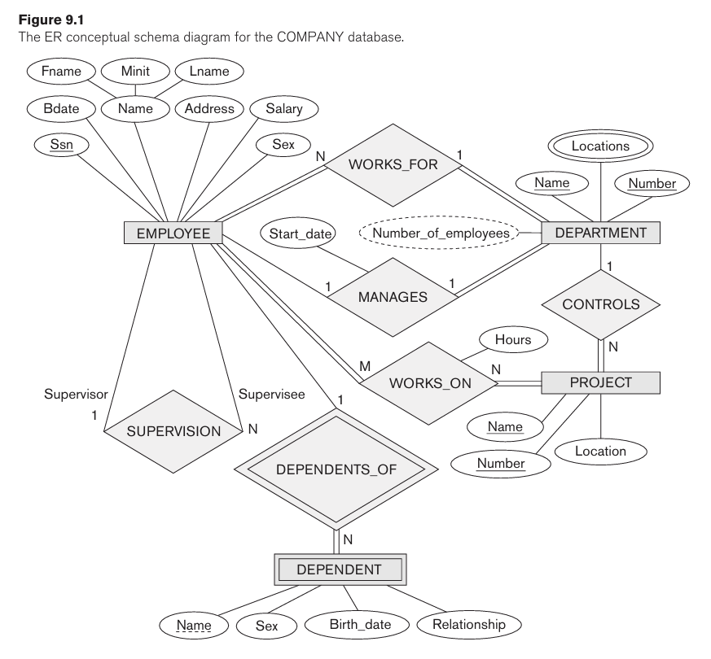
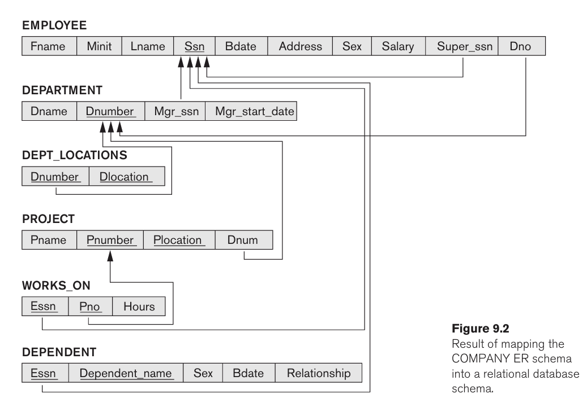

# Mapping ER Model To Relational Model

- **ER to Relational Mapping Algorithm:**
  - Step 1: Mapping of regular entity types.
  - Step 2: Mapping of weak entity types.
  - Step 3: Mapping of binary 1:1 relation types.
  - Step 4: Mapping of binary 1:N relationship types.
  - Step 5: Mapping of binary M:N relationship types.
  - Step 6: Mapping of multivalued attributes.
  - Step 7: Mapping of N-ary relationship types.
- **Mapping EER Model Constructs to Relations:**
  - Step 8: Options for mapping specialization or generalization.
  - Step 9: Mapping of union types (categories).

---

- **Example:**
  - **ER:**
    
  - **Relational:**
    

---

- **Mapping Specialization or Generalization:**
  - **Option A: Multiple relations-superclass and subclasses.**
    - Creates a relation for the superclass and its attributes, plus a relation for each subclass includes the specific (or local) attributes of it, plus the primary key of the superclass which is propagated to subclass relation and becomes its primary key also.
    - It also becomes a foreign key to the superclass relation.
    - This works for any constraints on the specialization:
      - disjoint.
      - overlapping.
      - total.
      - partial.
  - **Option B: Multiple relations-subclass relations only.**
    - Creates a relation for each subclass includes the specific (or local) attributes and all the attributes of the superclass.
    - The primary key of the superclass is propagated to subclass relation and becomes its primary key.
    - This works well only when _both the disjoint and total constraints hold_.
  - **Option C: Single relation with one type attribute and Option D: Single relation with multiple type attributes.**
    - Create a single relation to represent the superclass and all its subclasses.
    - An entity that doesn't belong to some subclasses will have NULL values for the specific attributes of these subclasses.
    - These options are not recommended if many specific attributes are defined for the subclass.
    - If few specific subclass attributes exist, however, these mappings are preferable to options A and B because they do away with the need to specify EQUIJOIN and OUTER UNION operations; therefore, they can yield more efficient implementation.
