# Introduction

## Computer System Structure
- Computer system can be divided into **four** components:
  - **Hardware**
    - provides basic computing resources.
    - CPU, memory, I/O devices.
  - **Operating system**
    - Controls and coordinates use of hardware among various applications and users.
  - **Application programs**
    - Define the ways in which the system resources are used to solve the computing problems of the users.
    - Ex, Word processors, compilers, web browsers, database systems, video games.
  - **Users**
    - People, machines, other computers.
- 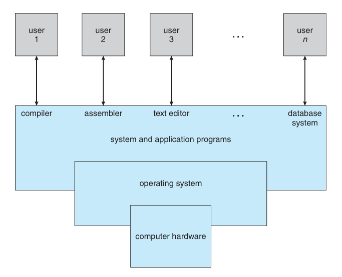

## What is an Operating System?
- An operating system is a program that manages a computer's hardware.
- It also provides a basis for application programs and acts as an intermediary between the computer user and the computer hardware.
- Operating system goals:
  - Execute user programs and make solving user problems easier.
  - Make the computer system convenient to use.
  - Use the computer hardware in an efficient manner.

## What Operating Systems Do?
- **User View**:
  - Users want convenience, ease of use and good performance.
    - Don't care about resource utilization.
  - But shared computer such as mainframe or minicomputer must keep all users happy.
- **System View**:
  - From the computer's point of view, the operating system is the program most intimately involved with the hardware. 
  - In the context, we can view an operating system as a **resource allocator**.
  - A computer system has many resources that may be required to solve a problem: CPU time, memory space, file-storage space, I/O devices, and so on.
  - The operating system acts as the **manager** of these **resources**.
- OS is a **resource allocator**:
  - Manages all resources.
  - Decides between conflicting requests for efficient and fair resource use.
- OS is a **control program**:
  - Controls execution of programs to prevent errors and improper use of the computer.
- A more common definition, and the one that we usually follow, is that the operating system is the one program running at all time on the computer—usually called the **kernel**.
- Along with the kernel, there are two other types of programs: 
  - **system programs**, which are associated with the operating system but are not necessarily part of the kernel.
  - and **application programs**, which include all programs not associated with the operation of the system.

## Computer System Organization
- A modern general-purpose computer system consists of one or more CPUs and a number of device controllers connected through a common bus that provides access to shared memory.
- 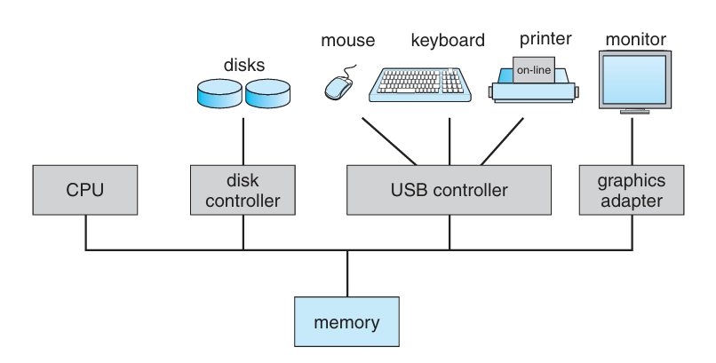
- **Computer Startup**:
  - **bootstrap** program is loaded at power-up or reboot
    - typically stored in ROM or electrically erasable programmable read-only memory (EPROM), generally known as **firmware**.
    - initializes all aspects of the system.
    - loads operating system kernel and starts execution.
- **Interrupts**:
  - The occurrence of an event is usually signaled by an interrupt from either the hardware or the software.
    - Hardware may trigger an interrupt at any time by sending a signal to the CPU, usually by way of the system bus.
    - Software may trigger an interrupt by executing a special operation called a **system call** (also called a **monitor call**).
  - Interrupts are an important part of a computer architecture.
  - Each computer design has its own interrupt mechanism, but several functions are common.
  - Interrupt transfers control to the interrupt service routine generally, through the **interrupt vector**, which contains the address of all service routines.
  - Interrupt architecture must save the address of the interrupted instruction.
  - A **trap** or **exception** is a software-generated interrupt caused either by an error or a user request.
  - An operating system is **interrupt driven**.

## Storage Structure
- 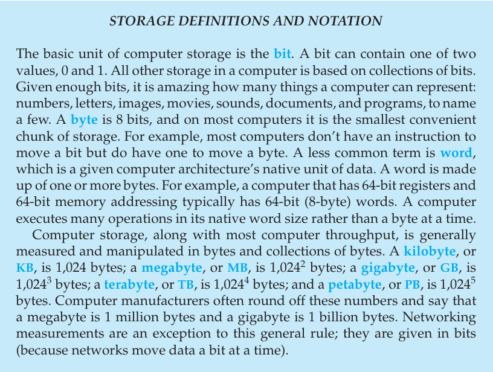
- **Main memory**:
  - only large storage media that the CPU can access directly.
  - Random access.
  - Typically volatile.
- **Secondary storage**:
  - extension of the main memory that provides large nonvolatile storage capacity.
  - **Hard disks**:
    - rigid metal or glass platters covered with magnetic recording material.
    - The disk surface is logically divided into tracks, which are subdivided into sectors.
    - The disk controller determines the logical interaction between the device and the computer.
  - **Solid-state disks (SSD)**:
    - faster than hard disks, nonvolatile.
    - Various technologies.
    - Becoming more popular.
- Storage systems organized in hierarchy:
  - Speed.
  - Cost.
  - volatility.
  - 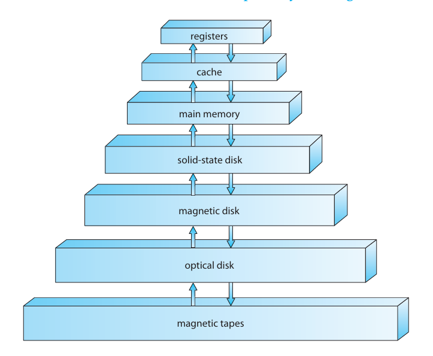

## How Modern Computer Works?
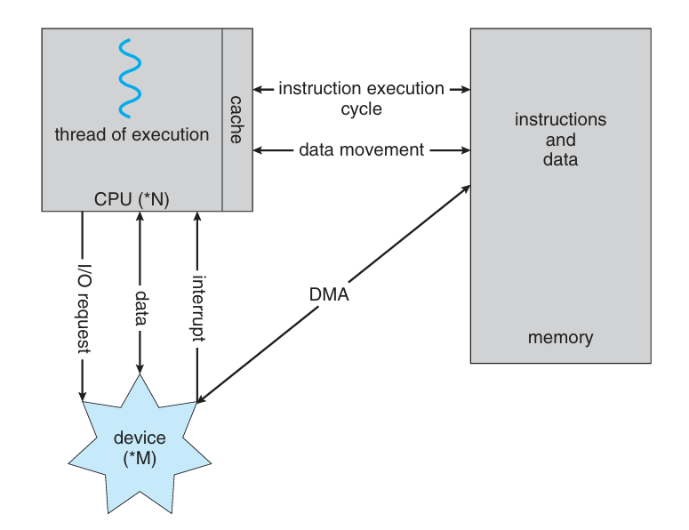

## Multiprocessing Architecture
- Multiprocessors systems growing in use and importance.
  - Also known as parallel systems.
  - Advantages include:
    1. Increased throughput: by increasing the number of processors, we expect to get more work done in less time.
    2. Economy of scale: Multiprocessors systems can cost less than equivalent multiple single-processor systems, because they can share peripherals, mass storage, and power supplies.
    3. Increased reliability: graceful degradation or fault tolerance.
  - Two types:
    1. Asymmetric multiprocessing: each processor is assigned a specie task.
    2. Symmetric multiprocessing: each processor performs all tasks.
       - 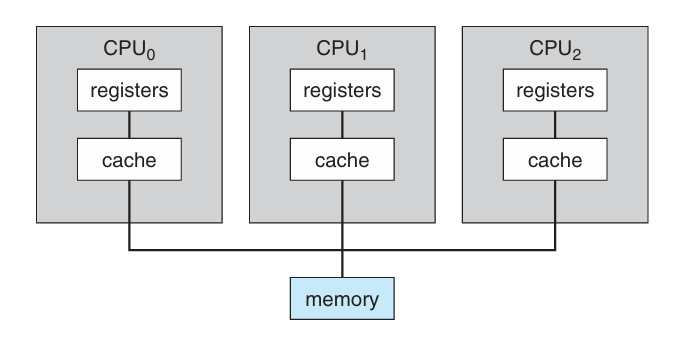

## A Dual-Core Design
- Multi-chip and multicore
  - 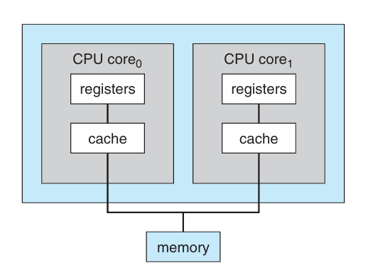

## Operating System Structure
- Multiprogramming (Batch system) needed for efficiency.
  - Single user can't keep CPU and I/O devices busy at all times.
  - Multiprogramming organizes jobs (code and data) so, CPU always has one to execute.
  - A subset of total jobs in a system is kept in memory.
  - One job selected and run via **job scheduling**.
  - When it has to wait (for I/O, for example), OS switched to another job.
- Timesharing (Multitasking) is a logical extension in which CPU switches jobs so frequently that users can interact with each job while it's running, creating interactive computing.
  - Response time should be < 1 second.
  - Each user has at least one program executed in memory → process.
  - If several jobs are ready to run at the same time, → CPU scheduling.
  - If processes don't fit in memory, swapping moves them in and out to run.
  - Virtual memory allows execution of processes not completely in memory.

## Operating System Operations
- **Interrupt driven** (hardware and software)
  - Hardware interrupt by one of the devices.
  - Software interrupt (exception or trap):
    - Software error (e.g., division by zero).
    - Request for operating system service.
    - Other process problems include infinite loop, processes modifying each other or the operating system.
- **Dual-mode** operation allows OS to protect itself and other system components.
  - User mode and Kernel mode (also called supervisor mode, system mode, or privileged mode).
- A **bit**, called the **mode bit**, is added to the hardware of the computer to indicate the current mode: kernel (0) or user (1).
  - Provides ability to distinguish when a system is running user code or kernel code.
  - Some instructions designed as privileged, only executable in kernel mode.
  - System call changes mode to kernel, return from call resets it to user.
  - 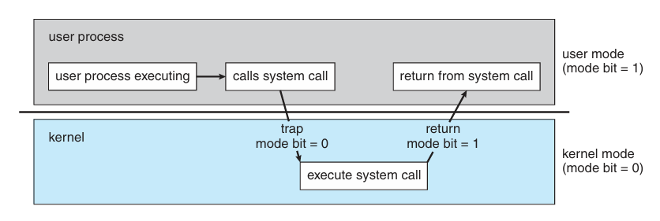

## Levels of Storage
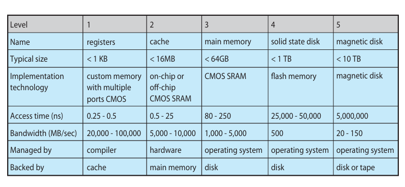

## Protection and Security
- **Protection**: any mechanism for controlling access of processes or users to resource defined by the OS.
- **Security**: defense of the system against internal and external attacks.
  - Huge range, including danial-of-service, worms, viruses, etc.

## Computing Environments
- The current trend is toward providing more ways to access these computing environments.
- Companies establish **portals**, which provide Web accessibility to their internal servers.
- **Network computers** (or **thin clients**)—which are essentially terminals that understand web-based computing—are used in place of traditional workstations where more security or easier maintenance is desired.
- Mobile computers interconnect via **wireless networks**.
- **Distributed computing**: Collection of separate, possibly heterogeneous, systems networked together.
  - Network is a communications path, TCP/IP most common
    - Local Area Network (LAN).
    - Wide Area Network (WAN).
    - Metropolitan Area Network (MAN).
    - Personal Area Network (PAN).
- **Network Operating System** provides features between systems across network.
- **Client-Server Computing**:
  - 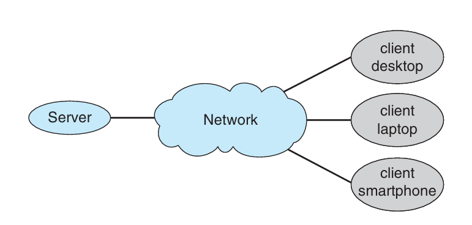
- **Peer-to-Peer**:
  - 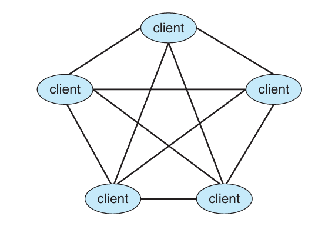
- **Virtualization**: is a technology that allows operating systems to run as applications within other operating systems.
- OS natively compiled for CPU, running **guest** OSes also natively compiled.
  - Consider VMware running WinXP guests, all running applications, all on native WinXP **host** OS.
  - VMM (virtual machine manager) provides virtualization services.
- **Cloud Computing**: delivers computing, storage, even apps as a service across a network.
  - **Public cloud**: available via Internet to anyone willing to pay.
  - **Private cloud**: run by a company for the company's own use.
  - **Hybrid cloud**: includes both public and private cloud components.
- **Software as a Service (SaaS)**:
  - One or more applications available via the Internet (i.e., word processor).
- **Platform as a Service (PaaS)**:
  - Software stack ready for application use via the Internet (i.e., a database server).
- **Infrastructure as a Service (IaaS)**:
  - Servers or storage available over Internet (i.e., storage available for backup use).
