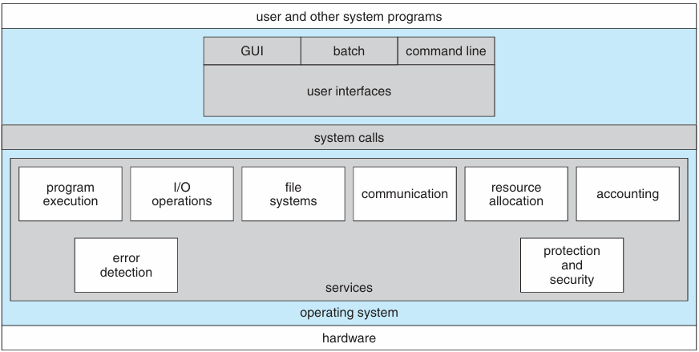
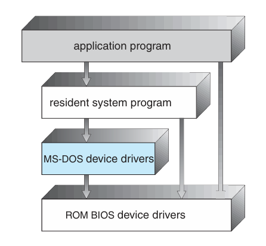
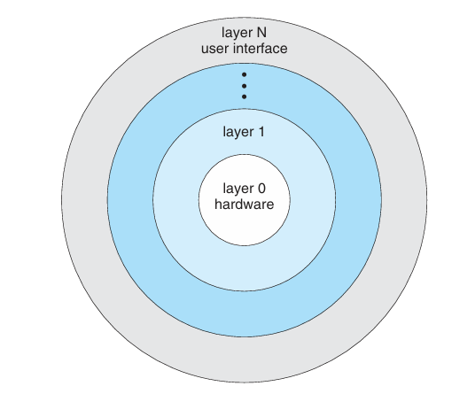

# Operating System Structures

## Operating System Services
- Operating systems provide an environment for execution of programs and services to programs and users.
- 
- One set of operating system services provides functions that are helpful to the user:
  - **User interface** — Almost all operating systems have a user interface (UI).
    - varies between Command-Line Interface (CLI), Graphics User Interface (GUI), Batch.
  - **Program execution** — The system must be able to load a program into memory and to run that program, end execution, either normally or abnormally (indicating error).
  - **I/O operations** — A running program may require I/O, which may involve a file or an I/O device.
  - **File-system manipulation** — The file system is of particular interests. Programs need to read and write files and directories, create and delete them, search them, list file information, permission management.
  - **Communications** — Processes may exchange information on the same computer or between computers over a network.
    - Communications may be via shared memory or through message passing (packets moved by the OS).
  - **Error detection** — OS needs to be constantly aware of possible errors.
    - May occur in the CPU and memory hardware, in I/O devices, in user program.
    - For each type of error, OS should take the appropriate action to ensure correct and consistent computing.
    - Debugging facilities can greatly enhance the user's and programmer's abilities to efficiently use the system.
- Another set of OS functions exists for ensuring the efficient operation of the system itself via resource sharing:
  - **Resource allocation** — When multiple users or multiple jobs running concurrently, resources must be allocated to each of them.
    - Many types of resources — CPU cycles, main memory, file storage, I/O devices.
  - **Accounting** — To keep track of which users use how much and what kinds of computer resources.
  - **Protection and security** — The owners of information stored in a multiuser of networked computer system may want to control use of that info, concurrent processes shouldn't interface with each other.
    - **Protection** involves ensuring that all access to system resources is controlled.
    - **Security** of the system from outsiders requires user authentication, extends to defending external I/O devices from invalid access attempts.

## User Operating System Interface
- **CLI** or **command interpreter** allows direct command entry.
  - Sometimes implemented in kernel, sometimes by systems program.
  - Sometimes multiple flavors implemented — **shells**.
  - Primarily fetches a command from a user and executes it.
  - Sometimes commands built-in, sometimes just names of programs.
- **Graphics User Interface (GUI)**
  - User-friendly desktop metaphor interface.
    - Usually mouse, keyboard, and monitor.
    - Icons represent files, programs, actions, etc...
    - Various mouse buttons over objects in the interface cause various actions (provide info, options, execute functions, open directory (known as a folder)).
  - Many systems now include both CLI and GUI interfaces.
- **Touchscreen Interfaces**
  - Touchscreen devices require new interfaces.
    - Mouse is not possible or not desired.
    - Actions and selection based on gestures.
    - Virtual keyboard for text entry.
  - Voice commands.

## System Calls
- Programming interface to the services provided by the OS.
- Typically written in a high-level language (C or C++).
- Mostly accessed by programs via a high-level **Application Programming Interfaces (API)** rather than direct system call use.
- Three most common APIs are Win32 API for Windows, POSIX API for POSIX-based systems (including virtually all versions of UNIX, Linux, and Mac OS X), and Java API for the Java virtual machine (JVM).

## Types of System Calls
1. Process control:
   - create process, terminate process.
   - end, abort.
   - load, execute.
   - get process attributes, set process attributes.
   - wait for time.
   - wait event, signal event.
   - allocate and free memory.
   - Debugger for determining bugs, single step execution.
   - Locks for managing access to shared data between processes.
2. File management:
   - create, delete file.
   - open, close file.
   - read, write, reposition.
   - get and set file attributes.
3. Device management:
   - request, release device.
   - read, write, reposition.
   - get, set device attributes.
   - logically attach or detach devices.
4. Information maintenance:
   - get, set time or date.
   - get, set system data.
   - get and set process, file, or device attributes.
5. Communications:
   - create, delete communication connection.
   - send, receive messages if message passing model to host name or process name.
   - from client to server.
   - shared-memory model creates and gains access to memory regions.
   - transfer status info.
   - attach and detach remote devices.
6. Protection:
   - control access to resources.
   - get and set permissions.
   - allow and deny user access.

## System Programs
- System programs provide a convenient environment for program development and execution.
- They can be divided into:
  - File manipulation.
  - Status information sometimes stored in a File modification.
  - Programming language support.
  - Program loading and execution.
  - Communications.
  - Background services.
  - Application programs.
- **File management** — Create, delete, copy, rename, print, dump, list, and generally manipulate files and directories.
- **Status information:**
  - Some ask the system for info — date, time, amount of available memory, disk space, number of users.
  - Others provide detailed performance, logging, and debugging information.
  - Typically, these programs format and print the output to the terminal or other output devices.
- **File Modification:**
  - Text editors to create and modify files.
  - Special commands to search the contents of files or perform transformations of the text.
- **Programming language support** — Compilers, assemblers, debuggers and interpreters sometimes provided.
- **Communications** — Provide the mechanism for creating virtual connections among processes, users, and computer systems.
  - Allow users to send messages to one another screen, browse web pages, send electronic-mail messages, log in remotely, transfer files from one machine to another.
- **Background services:**
  - Launch at boot time.
    - Some for system startup, then terminate.
    - Some from system boot to shut down.
  - Provide facilities like disk checking, process scheduling, error logging, printing.
- **Application programs:**
  - Don't pertain to a system.
  - Run by users.
  - Not typically considered part of OS.

## OS Design and Implementation
- Design and implementation of OS not "solvable," but some approaches have proven successful.
- Internal structure of different OSs can vary widely.
- Start the design by defining goals and specifications.
- Affected by choice of hardware, type of system.
- User goals and System goals:
  - User goals — operating system should be convenient to use, easy to learn, reliable, safe, and fast.
  - System goals — operating system should be easy to design, implement, and maintain, as well as flexible, reliable, error free, and efficient.
- Specifying and designing an OS is a highly creative task of software engineering.
- Much variation
  - Early OSes in assembly language.
  - Then system programming languages like Algol, PL/1.
  - Now C, C++.
- Actually usually a mix of languages
  - Lowest level in assembly.
  - Main body in C.
  - System programs in C, C++, scripting languages like PERL, Python, and shell scripts.

## Operating System Structure
- General-purpose OS is a very large program.
- Various ways to structure ones:
  - Simple structure — MS-DOS.
    - 
  - More complex — UNIX.
    - The UNIX OS consists of two separable parts:
      - System programs.
      - The kernel.
        - Consists of everything below the system-call interface and above the physical hardware.
        - Provides the file system, CPU scheduling, memory management, and other operating-system functions; a large number of functions for one level.
  - Layered.
    - 
  - Microkernel — Mach.
    - Moves as much from the kernel into user space.
    - Mach example of microkernel.
    - Mac OS X kernel (Darwin) partly based on Mach.
