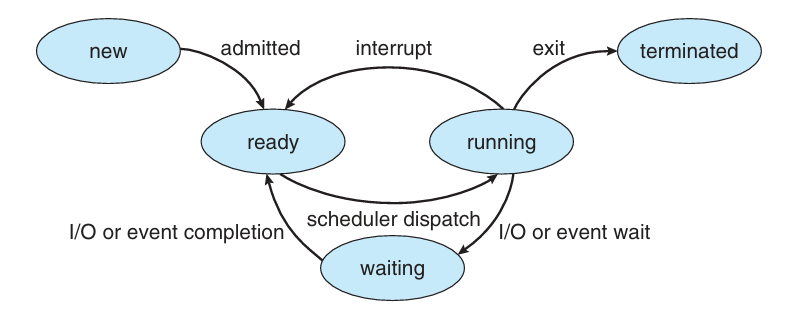
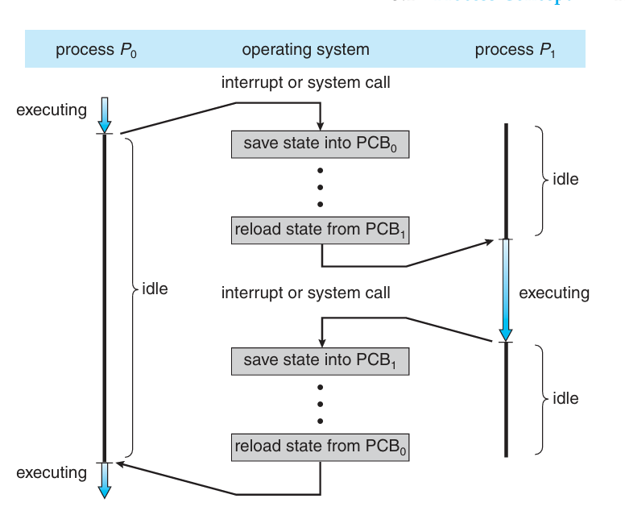

# Chapter 3: Processes

## Process Concept
- Program vs. Process
  - A **program** is a _passive_ entity such as the file that contains the list of instructions stored on a disk always referred to as an _executable file_.
  - A program becomes a **process** when an executable file is loaded into the memory and then becomes an _active_ entity.
- The fundamental task of any operating system is the process management.
- Processes include not only a text but also include a set of resources such as open files and pending signals.
- Processes also contain internal kernel data, processor state, an address space, and a data section.
- OS must allocate resources to processes, enable sharing of information, protect resources, and enable the synchronization among processes.

## Process Elements
- Segments of a process represent the following components:
  - **Text Section:**
    - the program code.
    - This is typically read-only, and might be shared by a number of processes.
  - **Data Section:**
    - containing global variables.
  - **Heap:**
    - containing memory dynamically allocated during run time.
  - **Stack:**
    - containing temporary data.
    - Function parameters, return addresses, local variables.

## Process Control Block (PCB)
- For better control of processes, operating systems need to consider their dynamic behaviors.
- Each process is represented in the OS by a Process Control Block (PCB).
- Process Control Block (PCB)
  - **Process identification information:**
    - Process identifier: numeric identifiers represent the unique process identifier.
    - User identifier: the user who is responsible for the job.
    - Identifier of the parent process that created this process.
  - **Process state information:**
    - Process state: running, waiting, etc...
  - **Program Counter:**
    - Location of instruction to next execute.
  - **CPU registers:**
    - contents of all process-centric registers.
  - **CPU scheduling information:**
    - priorities, scheduling queue pointers.
  - **Memory management information:**
    - memory allocated to the process.
  - **Accounting information:**
    - CPU used, clock time elapsed since start, time limits.
  - **I/O status information:**
    - I/O devices allocated to process, list of open files.

## Process State
- As a process executes, it changes state:
  - new: the process is being created.
  - running: instructions are being executed.
  - waiting: the process is waiting for some event to occur.
  - ready: the process is waiting to be assigned to a processor.
  - terminated: the process has finished execution.
- 

## CPU Switch From Process to Process
- 

## Process Scheduling
- **Job queue:** set of all processes in the system.
- **Ready queue:** set of all processes residing in the main memory, ready and waiting to execute.
- **Device queues:** set of processes waiting for an I/O device.
- Processes migrate among the various queues.

## Schedulers
- **Short-term scheduler (or CPU scheduler):**
  - Selects which process should be executed next and allocates the CPU.
  - Invoked frequently (milliseconds) → (must be fast).
- **Long-term scheduler (or job scheduler):**
  - Selects which processes should be brought into the ready queue.
  - Invoked infrequently (seconds, minutes) → (maybe slow).
  - Controls the degree of multiprogramming.
- **Medium-term scheduler:**
  - Can be added if the degree of multiple programming needs to decrease.
  - Remove the process from memory, store on disk, bring back in from disk to continue execution: **swapping**.

## Interprocess Communication
- Processes within a system maybe independent or cooperating.
- Cooperating process can affect or be affected by other processes, including sharing data.
- Cooperating processes need interprocess communication (IPC).
- Two models of IPC:
  - Shared memory.
  - Message passing.
- 
