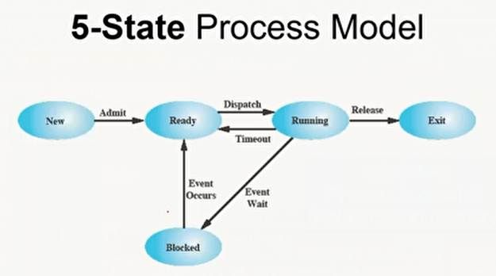

# Process, Switch & Locks

## Requirements of OS
- Fundamental Task: Process Management.
- The Operating System must:
  - **Interleave** the execution of multiple processes.
  - **Allocate** resources to processes.
  - **Protect** the resources of each process.
  - **Enable sharing** among processes.
  - **Enable synchronization** among processes.

---

## What is a "Process"?
- A program in execution.
- An instance of a program running on a computer.

## Process Elements
- A process comprises:
  - Program **code** (possibly shared).
  - A set of **data**.
  - User **stack** (for function calls & local variables).
  - User **heap** (for dynamic allocations).
  - **Process Control Block (PCB)**:
    - **Attributes** describing ALL required info about the process.

## Process Content
- Process Control Block includes WHAT?
  - Process Info:
    - Identifier, Priority, Parent ID, ...
  - Scheduling Info:
    - Thread control block(s) TCBs (CPU Reg's, State, ...)
  - Memory Info:
    - Tables, Working Sets.
  - I/O Info.
  - Files Info.
  - Accounting Info.
  - ...

## Process in FOS
- struct Env  inc/environment_definitions.h
```c++
struct Env {
    // MAIN INFO
    struct Trapframe *env_tf; // saved registers during 
    struct Context *context;
    LIST_ENTRY(Env) prev_next_info;
    int32 env_id;
    int32 env_parent_id;
    unsigned env_status;
    int priority;
    char prog_name[PROGNAMELEN];
    void* channel;
    
    // ADDRESS SPACE
    unit32 *env_page_directory;
    unit32 env_cr3;
    unit32 initNumStackPages;
    char* kstack
    
    // STATISTICS
    unit32 pageFaultsCounter;
    unit32 tableFaultsCounter;
    unit32 freeingFullWSCounter;
    unit32 freeingScarceMamCounter;
    unit32 nModifiedPages;
    unit32 nNotModifiedPages;
    unit32 env_runs;
    unit32 nPageIn, nPageOut, nNew;
    unit32 nClocks;
}
```

---

## Process States
### 5-State Process Model
1. New
   - null -> new
      - Process is created.
      - Not loaded in memory.
2. Ready
   - new -> ready
     - loaded in memory.
     - The Number of them is usually limited by OS.
3. Running
   - ready -> running
     - Moved to CPU to execute.
4. Exit
   - running -> exit
     - Terminated by OS.
     - Either completed or aborted.
   - ready -> exit
     - Terminated by its parent.
     - Or parent is terminated.
   - Timeout:
     - running -> ready
       - Reached max allowed time.
       - Preempted by OS to allow a higher-priority process.
       - Voluntarily release control to OS (e.g., background proc).
5. Blocked
   - running -> blocked
     - Wait on a request (e.g OS resource, I/O).
   - blocked -> ready
     - Waiting event is occurred.
- 
- Multiple Blocked **Queues**.
- PCBs move from queue to queue.
- **Scheduling**: which order to remove from queue.
#### Problem of 5-State Model
  - CPU is **faster** than I/O
    - All processes could be waiting for I/O.
    - Bad utilization of CPU.
#### Solution
- Swap these processes to disk to free up more memory and use CPU on more processes.
- Called **suspend** state when swapped to disk.
- Two new states:
  - Blocked/Suspend.
  - Ready/Suspend.

### 7-State Process Model
- Blocked/Suspend
  - The process is in secondary memory and awaiting an event.
  - blocked -> blocked/suspended
    - If no ready processes, swap-one out to make room for a ready one.
- Ready/Suspend
  - The process is in secondary memory and available for execution.
  - block/suspend -> ready/suspend
    - When the waiting-event occurred.
  - ready/suspended -> ready
    - When no ready processes.
    - Or it's a higher priority.
  - ready -> ready/suspended
    - Not common (blocked is preferred).
    - Needed if it's the only way to free a large enough block of RAM.
  - new -> ready/suspended
    - To maintain a large pool of non-blocked processes WHILE no room in RAM.
  - run -> ready/suspended
    - Not usual situation, done to free room for higher priority.

---

## Dual Mode Switching
| Mechanism   | Use                                    | Example                                                 |
|-------------|----------------------------------------|---------------------------------------------------------|
| Interrupt   | Reaction to an external event.         | String is read from KB.<br/> Printer is ready to print. |
| Exception   | Handling of error/exception condition. | Divide by zero.<br/> Page fault.                        |
| System call | Call to an OS function.                | cprintf()<br/> malloc()[new oper.]                      |


## Switching Models
1. One-to-One
   - Each user thread has its own kernel thread.
   - **Advantages**:
     - Improved concurrency and parallelism, as multiple threads can run simultaneously on different processors.
     - Allows for better responsiveness.
   - **Disadvantages**:
     - More overhead due to kernel involvement.
     - Creating and managing kernel threads is resource-intensive.
2. Many-to-One
   - Multiple-user level threads are mapped to a single kernel-level thread.
   - The user-level thread library handles all thread management (creation, scheduling, etc.).
   - **Advantages**:
     - Lightweight, simple to implement, efficient for CPU-bound tasks where concurrency is limited.
   - **Disadvantages**:
     - If one user thread blocks, all threads in the process are blocked.
     - Can't take advantage of multicore processors.
3. Many-to-Many
   - Multiple-user level threads are mapped to a smaller or equal number of kernel-level threads.
   - Allows for flexible mapping and scheduling of user threads to kernel threads.
   - **Advantages**:
     - Combines the benefits of both one-to-one and many-to-one models.
     - Allows for concurrency and parallelism while avoiding the overhead of the one-to-one model.
   - **Disadvantages**:
     - More complex to implement than the other two models.

## How to Switch? Programmable Interrupt Controller (PIC)
- Interrupts invoked with interrupt lines from H/W devices (interrupts).
- Or generated S/W (system calls) Or caused by it (exceptions).
- Interrupt controller chooses interrupt request to honor.
  - Interrupt identity specified with ID line.
  - Mask enables/disables interrupts ONLY.
  - Priority encoder picks the highest enabled interrupt.
- CPU can disable interrupts with an internal flag (sti() — cli() instr).
- Non-Maskable Interrupt Line (NML) can't be disabled.
  - Caused by H/W failure.

## How to Switch? Interrupt Descriptor Table (IDT)
