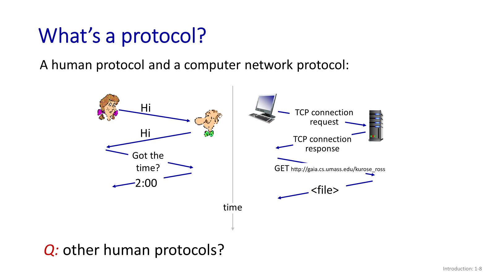

# Chapter 1 — Introduction

## Our goal:
- Get "feel" and terminology.
- More depth, detail later in course.
- Approach:
  - Use the internet as an example.

## Overview/Roadmap:
- What is the internet? What is a protocol?
- Network edge: hosts, access net, physical media.
- Network core: packet/circuit switching, internet structure.
- Performance: loss, delay, throughput.
- Security.
- Protocol layers.
- History.

## What's the internet: "nuts and bolts" view:
- Billions of connected computing devices:
  - _hosts_ = end systems
  - running network _apps_ at internet's "edge".
- Communication links (wireless/wired):
  - fiber, copper, radio, satellite.
  - transmission rate: 
    - _bandwidth_ (bit/second).
- Packet switches:
  - forward packets (chunks of data).
    - _routers_ (connect different networks),
    - and _switches_ (transfer data in the same network).
- Networks:
  - Collection of devices, routers, links: managed by an organization.
- **Notes**:
  - Computing device: any device that has a CPU.
  - Network apps: internet connectivity is a major component of the application.

## "Fun" Internet-connected devices:
- Many things around us can now use the internet to do amazing things.
- Ex:
  - Amazon Echo.
  - Internet refrigerator.
  - IP picture frame, etc..

## What's the internet: "nuts and bolts" view:
- Internet "network of networks":
  - Interconnected ISPs (Internet Service Providers).
    - Regional ISPs.
    - Global ISPs (connect regional ISPs).
- **Protocols** "rules" control sending, receiving of messages.
  - e.g. TCP, IP, HTTP, Skype, 802.11.
- Internet standards:
  - RFC: Request For Comments.
  - IETF: Internet Engineering Task Force.

## What's the Internet: a "service" view:
- **Infrastructure** that provides services to applications:
  - Web, streaming video, multimedia teleconferencing, email, games, e-commerce, social media, interconnected appliances, ...
- Provides **programming interface** ro distributed applications:
  - "hooks" allowing sending/receiving apps to "connect" to use internet transport service.
  - provides service options, analogous to postal service.

## What's a protocol?
- Human protocols:
  - "What's the time?"
  - "I have a question."
  - Introductions.
- Network protocols:
  - Computers (devices) rather than humans.
  - All communication activity on the internet is governed by protocols.
- Rules for:
  - ... specific messages sent.
  - ... specific actions taken when a message is received, or other events.
- **Protocols** define the _format, order_ of messages sent and received among network entities, and _actions taken_ on message transmission, receipt.
- Protocol is a technical document.
- 

## Internet History:
**1961-1972: Early packet-switching principles**.
- 1961: Kleinrock - queueing theory shows the effectiveness of packet-switching.
- 1964: Baran - packet-switching in military nets.
- 1967: ARPAnet conceived by Advanced Research Projects Agency.
- 1969: first ARPAnet node operational.
- 1972: 
  - ARPAnet public demo.
  - NCP (Network Control Protocol) first host-host protocol.
  - first e-mail program.
  - ARPAnet has 15 nodes.

