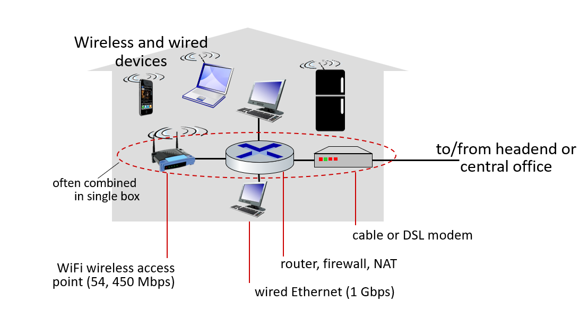
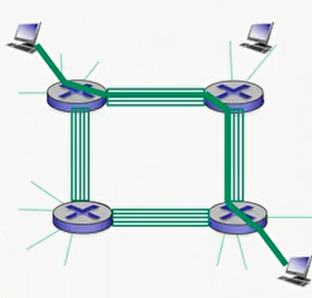

# Network Core and Edge

## A Closer Look at Network Structure
- **Network Edge**:
  - hosts: 
    - clients and servers.
    - servers often in data centers.
- **Access Networks, Physical Media**:
  - wired, wireless communication links.
- **Network Core**:
  - interconnected routers.
  - network of networks.

## Access Networks and Physical Media
- Q: How to connect end systems to edge router?
  1. Residential access nets (ISPs subscription).
  2. Institutional access networks (school, company).
  3. Mobile access networks (3G, 4G, 5G).
- Keep in mind:
  - Bandwidth (bits per second) of access networks?
  - Shared or dedicated?

## Access Network: Digital Subscriber Line (DSL)
- Use existing telephone line to central office DSLAM (DSL access multiplexer):
  - Data over DSL phone line goes to the Internet.
  - Voice over DSL phone line goes to the telephone net.
- < 2.5 Mbps upstream transmission rate (typically < 1 Mbps).
- < 24 Mbps downstream transmission rate (typically < 10 Mbps).

## Access Network: Cable Network
- Frequency division multiplexing:
  - Different channels transmitted in different frequency bands.
- HFC: hybrid fiber coax:
  - Asymmetric: up to 30 Mbps downstream transmission rate, 2 Mbps upstream transmission rate.
- Network of cable, fiber attaches homes to ISP router:
  - Homes share access network to cable headend.
  - Unlink DSL, which has dedicated access to central office.

## Access Network: Home Network

## Access Network: Enterprise Networks (Ethernet)
- Typically used in companies, universities, etc.
- Mix of wired, wireless link technologies, connecting a mix of switches and routers:
  - Ethernet: wired access at 100 Mbps, 1 Gbps, 10 Gbps.
  - Wi-Fi: wireless access points at 11, 54, 450 Mbps.

## Wireless Access Networks
- Shared wireless access network connects an end system to router.
  - via base station aka "access point."
- Wireless LANs:
  - within the building (100 ft.).
  - 802.11 b/g/n (Wi-Fi): 11, 54, 450 Mbps transmission rate.
- Wide-area wireless access:
  - provided by telco (cellular) operator, 10's km.
  - between 1 and 10 Mbps.
  - 3G, 4G: LTE.

## Host: Sends Packet of Data
- Host sending function:
  - takes the application message.
  - breaks into smaller chunks, known as **packets**, of length L.
  - transmits the packet into access network at transmission rate R.
    - link transmission rate, aka link capacity, aka link bandwidth.
- `packet transmission delay = time needed transmit L-bit packet into link = (L (bits) / R (bits/sec))`

## Physical Media
- bit:
  - propagates between transmitter/receiver pairs.
- physical link:
  - what lies between transmitter and receiver.
- guided media:
  - signals propagate in solid media: copper, fiber, coax.
- unguided media:
  - signals propagate freely, e.g., radio.
- twisted pair (TP):
  - two insulted copper wires
    - category 5: 100 Mbps, 1 Gbps Ethernet.
    - category 6: 10 Gbps.

## Physical Media: Coax, Fiber
- Coaxial cable:
  - two concentric copper conductors.
  - bidirectional.
  - broadband:
    - multiple channels on cable.
    - HFC.
- Fiber optic cable:
  - glass fiber carrying light pulses, each pulse a bit.
  - high-speed operation:
    - high-speed point-to-point transmission (e.g., 10's - 100's Gbps transmission rate).
  - low error rate:
    - repeaters spaced far apart.
    - immune to electromagnetic noise.

## Physical Media: Radio
- Signal carried in electromagnetic spectrum.
- No physical "wire."
- bidirectional.
- Propagation environment effects:
  - reflection.
  - obstruction by objects.
  - interference.
- Radio link types:
  - terrestrial microwave
    - e.g., up to 45 Mbps channels.
  - LAN (e.g., Wi-Fi)
    - 54 Mbps.
  - wide-area (e.g., cellular)
    - 4G cellular: ~ 10 Mbps.
  - satellite
    - Kbps to 45 Mbps channel (or multiple smaller channels).
    - 270 msec end-end delay.
    - geosynchronous versus low altitude.

## The Network Core
- Mesh of interconnected routers.
- Packet-switching: hosts break application-layer messages into packets
  - forward packets from one router to the next, across links on the path from source to destination.
  - each packet is transmitted at full link capacity.

## Packet-Switching: store-and-forward
- Takes L/R seconds to transmit (push out) L-bit packet into the link at R bps.
- Store and forward:
  - the entire packet must arrive at router before it can be transmitted on the next link.
- End-end delay = 2L/R (assuming zero propagation delay). -> more on delay shortly...
- One-hop numerical example:
  - L = 7.5 Mbits.
  - L = 1.5 Mbits.
  - one-hop transmission = 5 sec.

## Packet-Switching: queueing delay, loss
- Queuing and loss:
  - if the arrival rate (in bits) to link exceeds the transmission rate of the link for period of time:
    - packets will queue, wait to be transmitted on the link.
    - packets can be dropped (lost) if memory (buffer) fills up.

## Two Key Network-Core Functions
- Routing:
  - determines source-destination route taken by packets.
    - routing algorithm.
- Forwarding:
  - move packets from router's input to appropriate router output.

## Alternative Core: Circuit Switching
- End-end resources allocated to, reserved for "call" between the source & destination:
  - 
  - in diagram, each link has four circuits:
    - call gets 2nd circuit in the top link and 1st circuit in the right link.
  - dedicated resources: no sharing
    - circuit-like (guaranteed) performance.
  - circuit segment idle if not used by call (no sharing).
  - commonly used in traditional telephone networks.

## Packet Switching vs. Circuit Switching
- Packet switching allows more users to use the network.
- Example:
  - 1 Mb/s link.
  - each user:
    - 100 kb/s when "active."
    - active 10% of the time.
  - circuit-switching:
    - 10 users.
  - packet-switching:
    - with 35 users, probability > 10 active at the same time is less than .0004 *
- Is the packet switching a "slam dunk winner"?
  - Great for burst data.
    - resource sharing.
    - simpler, no call setup.
  - Excessive congestion possible: packet delay and loss
    - protocols needed for reliable data transfer, congestion control.
  - Q: How to provide circuit-like behavior?
    - bandwidth guarantees needed for audio/video apps.
    - still an unsolved problem.

## Internet Structure: Network of Networks
- End systems connect to the Internet via access ISPs.
  - residential, company, and university ISPs.
- Access ISPs in turn must be interconnected.
  - so that any two hosts can send packets to each other.
- The resulting network of networks is very complex.
  - evolution was driven by economics and national policies.
- **Option**:
  - connect each access ISP to one global transit ISP?
  - customer and provider ISPs have economic agreement.
