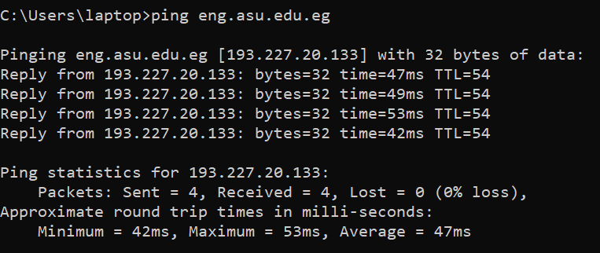
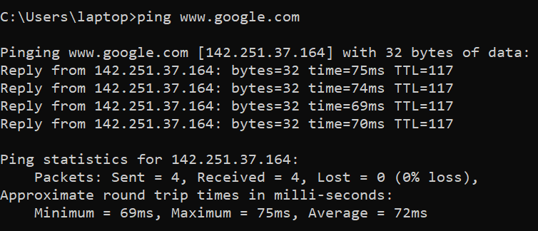

# Delays and Performance

## How do Loss and Delay Occur?
- Packets queue in router buffers
  - packet arrival rate to link (temporarily) exceeds output link capacity.
  - packet queue, wait for turn.

## Four Sources of Packet Delay
- **dnodal = dproc + dqueue + dtrans + dprop**
- dproc: nodal processing
  - check bit errors.
  - determine output link.
  - typically < msec.
- dqueue: queueing delay
  - time waiting at the output link for transmission.
  - depends on the congestion level of the router.
- dtrans
  - L: packet length (bits).
  - R: link bandwidth (bps).
  - dtrans = L/R. 
- dprop: propagation delay
  - d: length of the physical link.
  - s: propagation speed (~2x108 m/sec)
  - dprop = d/s.
- dtrans and dprop are very different.

## "Real" Internet Delays and Routes
- What do "real" internet delay and loss look like?
- traceroute program: provides delay measurement from source to router along an end-end internet path towards destination.
  - For all i:
    - sends three packets that will reach the router i on path towards destination.
    - router i will return packets to sender.
    - sender times interval between transmission and reply.
- 
- 

## Throughput
- rate (bits/time unit) at which bits transferred between sender/receiver.
  - instantaneous: rate at a given point in time.
  - average: rate over longer period of time.
- Bottleneck link:
  - link on end-end path that constraints end-end throughput.

### Throughput: Internet Scenario
- pre-connection end-end throughput: min(Rc, Rs, R/10).
- in practice: Rc or Rs is often bottleneck.
