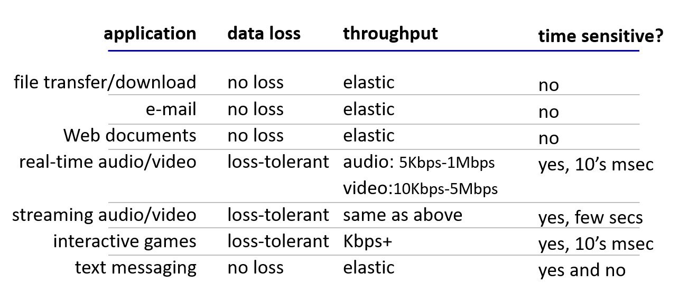

# Principles of Network Applications

## Creating a Network App
- Write program that:
  - run on (different) end systems.
  - communicate over network.
  - e.g., web server software communicates with browser software.
- No need to write software for network-core devices
  - network-core devices don't run user applications.
  - applications on end systems allow for rapid app development, propagation.

## Application Architecture
- Possible structure of applications;
  - Client-server.
  - Peer-to-Peer (P2P).

### Client-Server Architecture
- Server:
  - always-on host.
  - permanent IP address.
  - data centers for scaling.
- Clients:
  - communicate with server.
  - may be intermittently connected.
  - may have dynamic IP addresses.
  - don't communicate directly with each other.

### P2P Architecture
- No always-on server.
- Arbitrary end systems directly communicate.
- Peers request service from other peers, provide service in return to other peers.
  - Self-scalability: new peers bring new service capacity, as well as new service demands.
- Peers are intermittently connected and change IP addresses.
  - Complex management.

## Processes Communicating
- Process: program running within a host.
  - within some host, two processes communicate using inter-process communication (defined by OS).
  - processes in different hosts communicate by exchanging messages.
  - aside: applications with P2P architecture have client processes & server processes.
- clients, servers:
  - client process:
    - process that initiates communication.
  - server process:
    - process that waits to be contacted.

## Sockets
- Process sends/receives messages to/from its socket.
- Socket analogous to a door:
  - sending process shoves message out a door.
  - sending process relies on transport infrastructure on the other side of a door to deliver a message to a socket at a receiving process.

## Addressing Processes
- To receive messages, a process must have an identifier.
- Host device has unique 32-bit IP address.
- Q: Does the IP address of host on which process runs sufficing for identifying the process?
  - A: no, many processes can be running on the same host.
- The identifier includes both **IP address** and **port numbers** associated with a process on the host.
- Example port numbers:
  - HTTP server: 80
  - mail server: 25
- To send an HTTP message to gaia.cs.umass.edu web server:
  - IP address: 128.119.245.12
  - port number: 80

## App Layer Protocol Defines
- Types of messages exchanged,
  - e.g., request, response.
- Message syntax:
  - what fields im messages & how fields are delineated.
- Message semantics:
  - meaning of information in fields.
- Rules for when and how processes send & respond to messages.
- Protocols:
  - Open protocols:
    - defined in RFCs.
    - allows for interoperability.
    - e.g., HTTP, SMTP.
  - Proprietary protocols:
    - e.g., Zoom.

## What Transport Service Does an App Need?
- Data integrity:
  - some apps (e.g., file transfer, web transactions) require 100% reliable data transfer.
  - other apps (e.g., audio) can tolerate some loss.
- Timing:
  - some apps (e.g., Internet telephony, interactive games) require low delay to be "effective."
- Throughput:
  - some apps (e.g., multimedia) require a minimum amount of throughput to be "effective."
  - other apps ("elastic apps") make use of whatever throughput they get.
- Security:
  - encryption, data integrity, ...

### Transport Service Requirements: Common Apps

## Internet Transport Protocols Services
- TCP (Transmission Control Protocol) service:
  - reliable transport between sending and receiving process.
  - flow control: sender won't overwhelm receiver.
  - congestion control: throttle sender when network overloaded.
  - doesn't provide: 
    - timing.
    - minimum throughput.
    - guarantee.
    - security.
  - connection-oriented: setup required between client and server processes.
- UDP (User Datagram Protocol) service:
  - unreliable data transfer between a sending and receiving process.
  - doesn't provide:
    - reliability.
    - flow control.
    - congestion control.
    - timing.
    - throughput guarantee.
    - security.
    - or connection setup.
- Q: Why bother? Why is there a UDP?
  - A: Speed and lower overhead.
