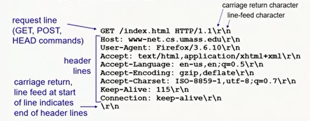
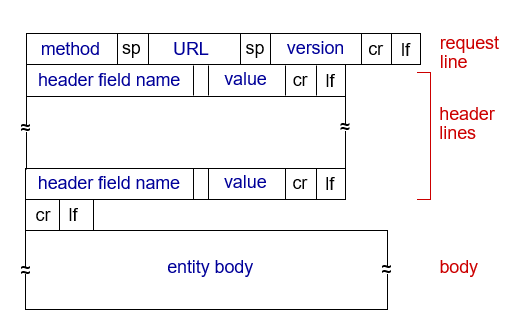

# Web and HTTP

## HTTP Overview
- HTTP: hypertext transfer protocol.
  - Web's application layer protocol.
  - client/server model:
    - client: browser that requests, receives, (using HTTP protocol) and displays Web objects.
    - server: Web server sends (using HTTP protocol) objects in response to requests.

## Web and HTTP
- The Web page consists of objects.
- Object can be HTML file, JPEG image, Java applet, audio file, etc...
- The Web page consists of an HTML file which includes several referenced objects.
- Each object is addressable by a URL, e.g.,
  - www.someSchool.edu/someDept/pic.gif
  - === host name ===/=== path name ===
- HTTP uses TCP:
  - client initiates TCP connection (creates socket) to server, port 80.
  - server accepts TCP connection from the client.
  - HTTP messages (application layer protocol messages) exchanged between browser (HTTP client) and Web server (HTTP server).
  - TCP connection closed.
- HTTP is "stateless"
  - server maintains no information about past client requests.
- Protocols that maintain "state" are complex.
  - history (state) must be maintained.
  - if server/client crashes, their views of "state" may be inconsistent, must be reconciled.

## HTTP Connections
- Non-persistent HTTP
  1. TCP connection opened.
  2. at most, one object sent over TCP connection
  3. TCP connection closed.
  - downloading multiple objects required multiple connections.
- Persistent HTTP
  1. TCP connection opened to a server.
  2. multiple objects can be sent over a single TCP connection between a client and that server.
  3. TCP connection closed.

### Non-persistent HTTP
- User enters URL: www.someSchool.edu/someDepartment/home.index (containing text, references to 10 jpeg images)
1. 
   - a. HTTP client initiates TCP connection to HTTP server (process) at www.someSchool.edu on port 80
   - b. HTTP server at host www.someSchool.edu waiting for TCP connection at port 80 "accepts" connection, notifying the client.
2. HTTP client sends an HTTP request message (containing URL) into TCP connection socket. The message indicates that the client wants object "someDepartment/home.index."
3. HTTP server receives a request message, forms a response message containing a requested object, and sends a message into its socket.
4. HTTP server closes TCP connection.
5. HTTP client receives a response message containing an HTML file, displays HTML. Parsing an HTML file, find 10 referenced jpeg objects.
6. Steps 1–5 repeated for each of 10 jpeg objects.

#### Non-persistent HTTP: Response Time
- RTT: time for a small packet to travel from client to server and back.
- HTTP response time:
  - one RTT to initiate TCP connection.
  - one RTT for HTTP request and the first few bytes of HTTP response to return.
  - file transmission time.
  - non-persistent HTTP response time = 2RTT + file transmission time.

### Non-persistent HTTP vs. Persistent HTTP
- non-persistent HTTP issues:
  - requires 2RTTs per object.
  - OS overhead for each TCP connection.
  - browsers often open parallel TCP connections to referenced objects.
- persistent HTTP:
  - server leaves connection open after sending response.
  - subsequent HTTP messages between the same client/server sent over open connection.
  - client sends a request as soon as it encounters a referenced object.
  - as little as one RTT for all the referenced objects.

---
- Two types of HTTP messages:
  - request
  - response.
---

## HTTP Request Message
- HTTP request message:
  - ASCII (human-readable format).
  - 
  - 
- Other HTTP request messages:
  - POST method:
    - web page often includes form input.
    - user input sent from client to server in entity body of an HTTP POST request message.
  - GET method (for sending date to server):
    - include user data in the URL field of an HTTP GER request message (following a '?').
  - HEAD method:
    - requests headers (only) that would be returned if specified URL were requested with an HTTP GET method.
  - PUT method:
    - uploads a new file (object) to server.
    - completely replaces a file that exists at specified URL with content in entity body of a POST HTTP request message.
- Method types:
  - HTTP/1.0:
    - GET
    - POST
    - HEAD
      - asks server to leave the requested object out of response.
  - HTTP/1.1:
    - GET, POST, HEAD
    - PUT
      - uploads a file in the body to a path specified in the URL field.
    - DELETE
      - deletes a file specified in the URL field.

## HTTP Response Message
- status line (protocol -> HTTP/1.1 200 OK status code status phrase).
- HTTP response status codes:
  - status code appears in 1st line in server-to-client response message.
  - some sample codes:
    - 200 OK
      - request succeeded, requested object later in this message.
    - 301 Moved Permanently
      - requested object moved, new location specified later in this message (in Location: field).
    - 400 Bad Request
      - request msg not understood by server.
    - 404 Not Found
      - requested document not found on the server.
    - 505 HTTP Version Not Supported

## Maintaining User/Server State: Cookies
- Websites and client browsers use cookies to maintain some state between transactions.
- Four components:
  1. cookie header line of HTTP response message.
  2. cookie header line in the next HTTP request message.
  3. cookie file kept on user's host, managed by user's browser.
  4. backend database at website.
- Example:
  - Susan uses a browser on laptop, visits a specific e-commerce site for the first time.
  - when initial HTTP requests arrive at site, site creates:
    - unique ID (aka "cookie")
    - entry in backend database for ID
  - subsequent HTTP requests from Susan to this site will contain cookie ID value, allowing site to "identify" Susan.
- What cookies can be used for:
  - authorization
  - shopping carts
  - recommendations
  - user session state (Web e-mail)
- Challenge: How to keep the state?
  - at protocol endpoints: maintain state at sender/receiver over multiple transactions.
  - in messages: cookies in HTTP messages carry state.
- Cookies and privacy:
  - cookies permit sites to learn a lot about you on their site.
  - third party persistent cookies (tracking cookies) allow common identity (cookie value) to be tracked across multiple websites.

## Web Caches
- Goal: satisfy client requests without involving origin server.
- User configures browser to point to a (local) Web cache.
- Browser sends all HTTP requests to cache:
  - if the object in cache: cache returns object to the client.
  - else cache requests object from origin server, caches the received object, then returns object to the client.

### Web Caches (aka Proxy Server)
- Web cache acts as both client and server
  - server for an original requesting client.
  - client to origin server.
- Server tells cache about object's allowable caching in response header:
  - `Cache-Control: max-age=<seconds>`
  - `Cache-Control: no-cache`
- Why Web caching?
  - reduce response time for client request
    - cache is closer to the client.
  - reduce traffic on an institution's access link.
  - Internet is dense with caches
    - enables "poor" content providers to more effectively deliver content.
