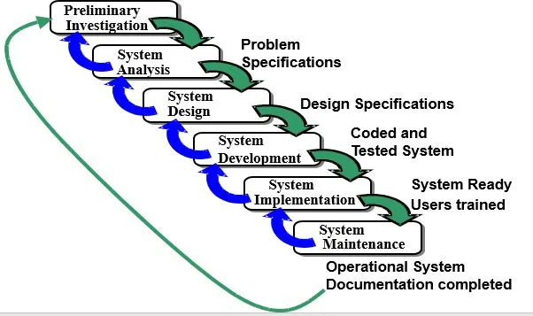

# Chapter 1 - The Systems Analyst and Information Systems Development [Part 1]

## Course Description:
- **System Analysis** is ...
  - The study of a current business system and its problems/opportunities,
  - The determination and definition of business needs and information/technology requirements, and
  - The evaluation/ranking of alternative solutions.
- System Analysis and Design is the _art of problem-solving_.
- Scientific methodology of thinking.
- "Imagination is more important than knowledge." — Albert Einstein.
- **System Design** is the general and detailed specification of a computer and human solution that meets the requirements determined during systems analysis.
- During the life of a system, **A System Analyst** may monitor or evaluate its ability to continue to meet business requirements, and will design and implement modifications and enhancements in response to end-user requests and environmental changes.

## Course Objectives:
- The main objectives of the course are to:
  - Introduce the students to the area of Information System Analysis and Design.
  - Includes basic concepts necessary to correctly _collect_ and _analyze_ the system _data_ and _requirements_.
  - Understanding and learning _data collection_ and _analysis_ various _techniques_.
  - Teaching and acquiring _system analyst skills_ (technical, personal ...etc.) and _roles_. 
  - Learning and implementing various _data and process modeling tools_.
  - Prepares students to actually analyze and design a small information system (practical case study).

## System (General) Definition:
- is a group of _interconnected, integrated, interrelated components_ (subsystems with specific relationships) working together towards achieving a common objective by accepting _inputs_ and producing _outputs_ through an organized transformation process under specific regulations.
- The subsystems work in a system boundary.
- Closed loop system: feedback is necessary for evaluating outputs.
- Open system: a system that interacts with the environment.

## Information Systems:
- An arrangement of people, data, processes, communications, and information technology that interact to support and improve day-to-day operations in a business, as well as support the problem-solving and decision-making needs of management and users.
- Structure of IS (Main elements):
  - Hardware.
  - Software.
  - Database.
  - Procedure.
  - Operating personnel.
  - Input and output.
  - Medium and message.

## Computer-Based Information Systems:

## Systems Applications in the Organization:

- Transaction Processing System (TPS).
- Decision Support System (DSS).
- Expert Support System (ESS).
- Management Information System (MIS).
- Executive Support System (ESS).
- Other IS (Office Support System, Knowledge Support System).

## Introduction:
- **Systems Development Life Cycle (SDLC)** is ...
  - the process of determining how an Information System can support business needs, designing the system, building it and delivering it to users.
  - a methodology used to describe the process for building IS.
  - a systematic approach for scientific thinking and solving problems.
  - divided into sequential phases, arranged in logical order; each phase has unique activities (steps).
- The key person in the SDLC is the **systems analyst** who analyzes the business situation, identifies the opportunities for improvements, and designs an IS to implement the improvements.

## The Systems Analyst:
- Plays a key role in IS development projects.
- Works closely with all project team members so that the team develops the right system effectively.
- Must understand how to apply technology to solve problems.
- May serve as **Change Agents** who identify organizational improvement needed, design systems to implement those changes, and train and motivate others to use the systems.

## Systems Analyst Skills:
- Technical:
  - Must understand the technical environment, technical foundation, and technical solution.
- Business:
  - Must understand how IT can be applied to a business solution.
- Analytical:
  - Must be problem solvers.
- Interpersonal:
  - Need to communicate effectively.
- Management:
  - Need to manage people and to manage pressure and risks.
- Ethical:
  - Must deal fairly, honestly, and ethically with other project members, managers, and system users.

## System Analysts Roles:
- Business Analyst:
  - Focuses on the business issues surrounding the system.
- Systems Analyst:
  - Focuses on the IS issues surrounding the system.
- Infrastructure Analyst:
  - Focuses on technical issues.
- Change Management Analyst:
  - Focuses on the people and management issues surrounding the system installation.
- Project Manager:
  - Ensures that the project is completed on time and within budget, and that the system delivers the expected value to the organization.

## Career Paths for Systems Analyst

