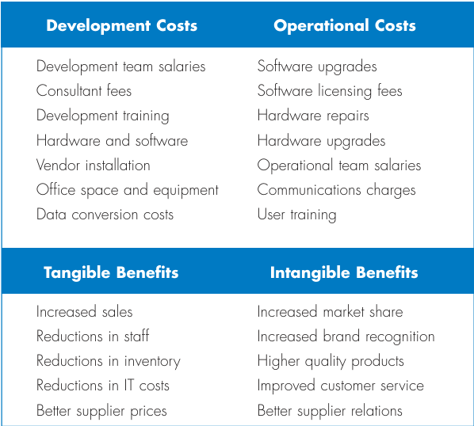
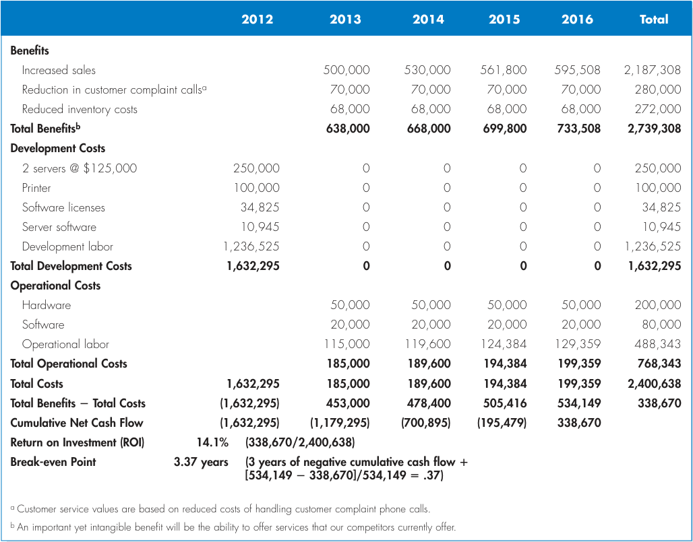

# Chapter 1 - The Systems Analyst and Information Systems Development [Part 2]

## System Development Life Cycle (SDLC)
- The SDLC is composed of four vital phases:
  - Planning.
  - Analysis.
  - Design.
  - Implementation.
- Each of the sequential SDLC phases is composed of consecutive steps and activities, which rely on appropriate tools and techniques (models and templates) that produce deliverables (specific technical documents that explain various elements of the system).

### Planning Phase
- is the fundamental process of understanding **why** an IS should be built, and determining **how** the project team will go about building it.
- By "problems" that need solving, we mean:
  - **Problems**, either real or expected, that require corrective action.
  - **Opportunities** to improve the situation despite the absence of complaints.
  - **Directives** to change the situation regardless of whether anyone has complained about the current situation.
- The planning phase has two steps:
  1. During **project initiation**, the system's business value to the organization is identified (how will it lower costs or increase revenues?).
  2. During **project management**, the project manager creates a work plan, staffs the project, and puts techniques in place to help the project team control and direct the project through the entire SDLC.

#### Project Identification and Initiation
- `Project/Problem Identification, Project Formulation and Preparation, Project Implementation, Project Monitoring and Evaluation`.
- A project is identified when someone in the organization identifies a business need to build an improved system.
- A need may surface when an organization identifies unique and competitive ways of using IT.
- To leverage the capabilities of new emerging technologies such as Cloud Computing, IOT, Block Chain, RFID, Web 2.0...

#### Business Process Management (BPM)
- Nowadays, many new IS projects grow out of BPM.
- It is a methodology used by organizations to continuously improve end-to-end business processes.
- `Design, Modeling, Execution, Monitroing, Optimization`.
- **BPM Process**:
  - Defining and mapping the steps in a business process.
  - Creating ways to improve on the steps in the process that add value.
  - Finding ways to eliminate or consolidate steps in the process that don't add value.
  - Creating and adjusting electronic workflows to match the improved process maps.
- **Business Process Automation (BPA)**:
  - Technology components are used to complement or substitute a manual process.
- **Business Process Improvement (BPI)**:
  - creating new, redesigned processes to improve the workflows, and/or using new technologies enabling new process structure.
- **Business Process Reengineering (BPR)**:
  - changing the fundamental way in which the organization operates.

#### Project Sponsor
- is a person (or group) who has an interest in the system's success.
- Work throughout the SDLC to make sure that the project is moving in the right direction from the perspective of the business.
- Serves as the primary point contact for the project team.
- The size or scope of the project is determined by the kind of sponsor that is involved.
- He has the insights needed to determine the business value that will be gained from the system.
- **Tangible value** can be quantified and measured easily (reduction in operating costs).
- An **intangible value** results from an intuitive belief that the system provides important, but hard-to-measure benefits to the organization.

#### System Request
- The document that describes the business reasons for building a new system and the value (benefits) that system is expected to provide.
- The project sponsor usually completes this form as part of a formal system process within the organization.
- **The business requirements** of the project refer to the business capabilities that the system will need to have.
- **The business value** describes the benefits that the organization should expect from the system.
- **Special issues** are included in the document as a general category for other information that should be considered in assessing the project.
- The completed system request is submitted to the approval committee for consideration.
- The committee reviews the system request and makes an initial determination of whether to investigate the proposed project or not.
- If so, the next step is to conduct a **Feasibility Analysis**.

#### Feasibility Analysis
- guides the organization in determining whether to proceed with a project.
- It also identifies the important risks associated with the project that must be managed if the project is approved.
- As with the system request, each organization has its own process and format for the feasibility analysis, but most include techniques to access three main areas:
    1. Technical feasibility.
    2. Economic feasibility.
    3. Organizational (Operational) feasibility.
- The results of evaluating these three feasibility factors are combined into a feasibility study deliverable submitted to the approval committee at the end of project initiation.

#### Technical Feasibility
- is the extent to which the system can be successfully designed, developed, and installed by the IT group.
- It is, in essence, a technical risk analysis that strives to answer the question: **"Can we build it?"**
- Risks can threaten the successful completion of a project.
- The following aspects should be considered:
  - Users and analysts should be familiar with the application.
  - Familiarity with the technology.
  - Project size.
  - Compatibility of the new system with the technology that already exists.

#### Economic Feasibility
- Economic Feasibility Analysis is also called a Cost-benefit Analysis, that identifies the costs and benefits associated with the system.
- This attempts to answer the question: **"Should we build the system?"**

#### Cash Flow Analysis and Measures
- IT projects involve an initial investment that produces steam of benefits over time, along with some ongoing support costs.
- Cash flows, both inflows and outflows, are estimated over some future period.
- Common Methods for Evaluating a Project's Worth
  - Return on Investment (ROI).
    - ROI = (Total benefits - Total costs) / Total costs.
  - Break-Even Point (BEP).

#### Discount Cash Flow Technique
- Discounted case flows are used to compare the **present value** of all cash inflows and outflows for the project in the today's dollar terms.
  - PV = Cash flow amount / (1 + rate of return)^2
- Net present value (NPV)
  - the difference between the total PV of the benefits and the total PV of the costs.

#### Steps to Conduct an Economic Feasibility Analysis
1. Identify costs and benefits.
2. Assign values to costs and benefits.
3. Determine cash flow.
4. Assess project's economic value:
   - ROI
   - BEP
   - NPV

##### Identify Costs and Benefits
- The costs and benefits are broken down into four categories:
  - Development costs.
  - Operational costs.
  - Tangible benefits.
  - Intangibles.
- 

##### Assign Values to Costs and Benefits
- Once the types of costs and benefits have been identified, the systems analysts need to assign specific dollar values to them.
- 

##### Determine Cash Flow
- A formal cost-benefit analysis usually contains costs and benefits over a selected number of years to show cash flow over time.
  - Determine ROI.
  - Determine BEP.
  - Determine NPV.

#### Organizational Feasibility
- The Organizational Feasibility of the system is how well the system ultimately will be accepted by its users and incorporated into the ongoing operations of the organization.
- There are many organizational factors that can have an impact on the project, and seasoned developers know that organizational feasibility can be the most difficult feasibility dimension to access.
- In essence, an organizational feasibility analysis is to answer the question: **"If we build it, will they come?"**
- Two main ways to assess the organizational feasibility:
  1. To understand how well the project goals align with the business objectives and organizational strategies.
  2. To assess the organizational feasibility is to conduct **stakeholder analysis**.
     - A stakeholder is the person, group, or organization that can affect a new system:
       - project champion.           
       - customer, suppliers.
       - system users.               
       - competitors, government.
       - organizational management.  
       - other stakeholders.

### Analysis Phase
- The analysis phase answers the questions of **who** will use the system, **what** the system will do, **where**, **why**, and **when** it will be used.
- During this phase, the project team investigates any current system(s), identifies improvement opportunities, and develops a concept for the new system.
- The analysis phase has three steps:
  1. Analysis Strategy:
     - This is developed to guide the project team's efforts.
     - This includes a study of the current system and its problems, and envisioning ways to design a new system.
  2. Requirements Gathering:
     - The analysis of this information leads to the development of a concept for a new system.
     - This concept is used to build a set of analysis models.
  3. System Proposal:
     - The proposal is presented to the project sponsor and other key individuals who decide whether the project should continue to move forward.

### Design Phase
- The design phase decides **how** the system will **operate**, in terms of the technical components:
  - Hardware, software, and network infrastructure.
  - The user interface, forms, and reports that will be used.
  - The specific programs, databases, and files that will be needed.
- The design phase has four steps:
  1. Design Strategy:
     - This clarifies whether the system will be developed by the company or outside the company.
  2. Architecture Design:
     - This describes the hardware, software, and network infrastructure that will be used.
  3. Database and File Specifications:
     - These documents define what, how, and where the data will be stored.
  4. Program Design:
     - Defines what programs need to be written and what they will do.

### Implementation Phase
- During the implementation phase, the system is either developed or purchased (in the case of package software), tested, and installed.
- Users Training and Education.
- This phase is usually the longest and most expensive part of the process.
- The implementation phase has three steps:
  1. System Construction:
     - The system is built and tested to make sure it performs as designed.
  2. Installation:
     - The old system is turned off and the new one is turned on.
  3. Support Plan:
     - Includes a post-implementation review as well as a systematic way for identifying changes needed for the system.

