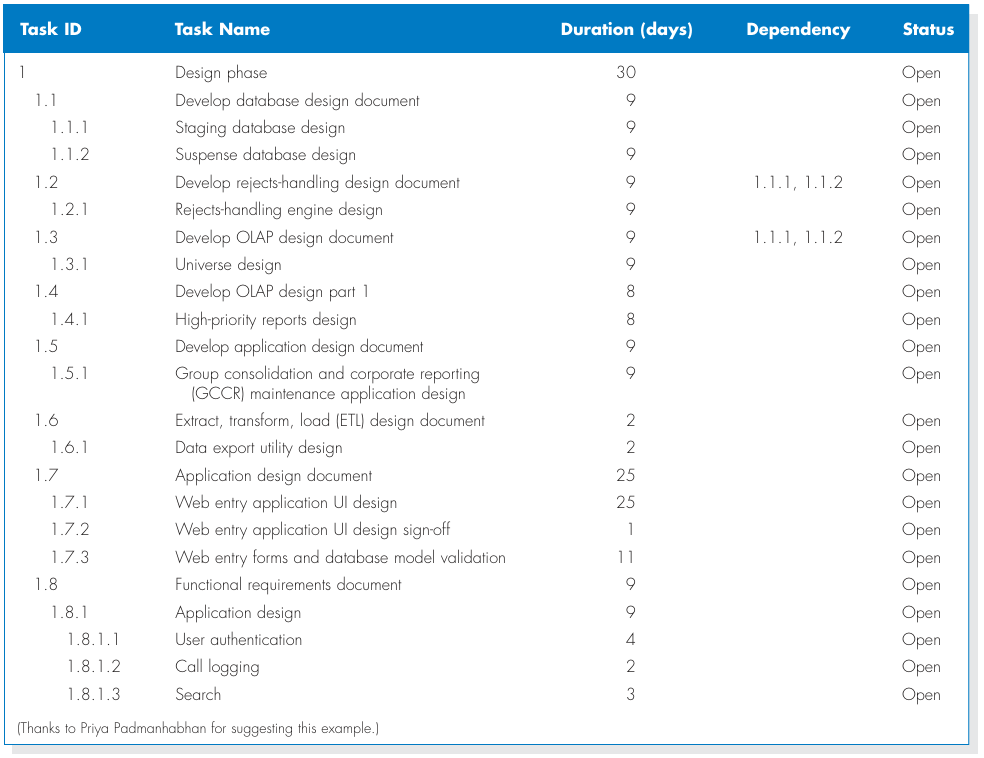

# Chapter 2 - Project Selection and Management

## Introduction
- **CIOs (Chief Information Officers)** are challenged to select projects that will provide the highest return on the IT investments.
- **Project Portfolio Management** recently has become a critical success factor for IT departments.
- A selected system development project must undergo a thorough process of project management.
- A critical success factor for project management is to start with a realistic assessment of the work and then manage the project according to the plan.

## Project Selection
- Systems projects today are evaluated in the context of an entire portfolio of projects.
- Determination of a project's contribution to an entire portfolio of a project reinforces the need for a feasibility study.
- Portfolio Management takes into consideration the difference between projects that exist in a business organization.
- Ways to characterize projects:
  - Size.
  - Cost.
  - Purpose.
  - Length.
  - Risk.
  - Scope.
  - Economic value.
- An approval committee must be selective about _where_ to _allocate resources_ as most business organizations have limited funds.
- If there are several potentially high-payoff projects, and they all have the same risk, then maybe only one of the projects will be selected. 

## Creating the Project Plan
- Project management phases consist of:
  - Initiation.
  - Planning.
  - Execution.
  - Control.
  - Enclosure.

## Project Methodology Options
- A methodology is a formalized approach for implementing the SDLC.
  - Waterfall development.
  - Parallel development.
  - V-model (variations of the Waterfall development).
  - Rapid Application Development (RAD)
    - Iterative development.
    - System prototyping.
  - Agile development.

### Waterfall Development
- 
- Advantages:
  - provides clear structure with predictable phases, defined milestones, and comprehensive documentation.
  - works well for projects with stable requirements, offering better budget estimation and allowing teams to focus on one phase at a time.
- Disadvantages:
  - The rigid structure makes it difficult to handle changing requirements, with testing and feedback coming too late in the process.
  - This can lead to expensive fixes, integration problems, and potential rework if initial requirements were misunderstood.

### Parallel Development
- 
- involves multiple teams or developers working simultaneously on different components, modules, or features of the same project.
- Advantages:
  - Faster development through simultaneous work and better resource utilization.
- Disadvantages:
  - Complex coordination, integration challenges, and higher risk of conflicts.
- Best for:
  - Large projects with independent components and strong project management.

### V-model Development
- 
- Advantages:
  - Strong testing focus with each development phase having a corresponding test phase, better quality assurance, and clear traceability between requirements and tests.
- Disadvantages:
  - Rigid structure like waterfall, expensive to make changes, and testing occurs late despite the testing emphasis on planning.
- Best for:
  - Safety-critical systems, regulated industries, and projects where thorough testing and documentation are mandatory.

### Rapid Application Development (RAD): Iterative Development
- 
- Advantages:
  - Fast delivery through iterative cycles, early user feedback, flexible to changing requirements, and emphasis on prototyping and user involvement.
- Disadvantages:
  - Requires skilled developers, may sacrifice documentation, not suitable for large teams, and can lead to scope creep without proper control.
- Best for:
  - Small to medium projects with active user participation, tight deadlines, and evolving requirements.

### Rapid Application Development (RAD): System Prototyping
- 
- Advantages:
  - Early visualization of the system, immediate user feedback on design and functionality, reduced risk of building wrong features, and faster requirement validation.
- Disadvantages:
  - Prototypes may be mistaken for final products, can lead to unrealistic expectations, potential for over-engineering prototypes, and time spent on throwaway code.
- Best for:
  - Projects with unclear requirements, user interface-heavy applications, and when stakeholder buy-in is crucial before full development.
#### Throwaway Prototyping
- 
- Advantages:
  - Quick exploration of ideas without commitment, helps clarify uncertain requirements, low cost to experiment with different approaches, and eliminates pressure to make prototype code production-ready.
- Disadvantages:
  - Time and resources spent on code that gets discarded, potential resistance from stakeholders to "waste" the prototype, and the risk of accidentally using prototype code in production.
- Best for:
  - High-uncertainty projects, exploring technical feasibility, and validating concepts before committing to full development.

### Agile Development
- Agile Development Supporters:
  - Adaptive planning,
  - Early delivery,
  - Evolutionary development,
  - Continuous improvement, and
  - Rapid and flexible response to change.
- Development follows a continuous improvement cycle, exposing flaws faster and reducing waste.
- Value is achieved faster as releases arrive at the customer more frequently.
- Advantages:
  - Shorter development cycles.
  - Wider market windows.
  - Early customer feedback.
  - Continuous improvement.
- A group of programming-centric methodologies that focus on streamlining the SDLC.
- Includes interactive face-to-face communication.
- **Extreme Programming (XP)** emphasizes customer satisfaction and teamwork.
  

## Selecting Appropriate Development Methodology
- Important factors to be considered in selecting the appropriate development methodology:
  - Clarity of user requirements.
  - Familiarity with technology.
  - System complexity.
  - System reliability.
  - Short time schedules.
  - Schedule visibility.

## Estimating the Project Time Frame
1. Estimating project time using _industry standards_.
   
2. Function point approach.

## Developing the Work Plan
- Identify tasks
  
- Work breakdown structure
  
- The project work plan
  

## Staffing the Project
- Staffing plan:
  - Staffing levels will change over a project's lifetime.
  - Adding staff may add more overhead than additional labor.
  - Using teams of 8-10 reporting in a hierarchical structure and reduce complexity.
- Reporting structure
  
- The staffing plan describes the kinds of people working on the project.
- The project charter describes the project's objectives and rules.
- A functional lead manages a group of analysts.
- A technical lead directs the progress of programmers and technical staff members.

## Motivation
- Use economic rewards cautiously.
- Use essential rewards:
  - Recognition.
  - Achievement.
  - The work itself.
  - Responsibility.
  - Advancement.
  - Chance to learn new skills.

## Handling Conflict
- Clearly define plans for the project.
- Recognize the project's importance to business organization.
- Project charter listing norms and ground rules.
- Develop schedule commitments ahead of time.
- Forecast other priorities and their possible impact on the project.

## Coordinating Project Activities
- CASE (Computer-aided Software Engineering) Tools: a category of software that automates all or part of the development process.
  - Upper CASE.
  - Lower CASE.
  - Integrated CASE.
- Standards
  - Formal rules for naming files.
  - Forms indicating goals reached.
  - Programming guidelines.
- Documentation
  - Project binder.
  - Table of contents.
  - Continual updating.

## Managing and Controlling Project
- The science (or art) of project management is in making trade-offs among three important concepts:
  - The system size,
  - The time to complete the project, and
  - The project cost.

## Refining Estimates

## Manging Scope
- Scope creep:
  - the most common reason for schedule and cost overruns occurs after the project is underway.
- The project manager should allow only the absolutely _necessary requirements_ to be added after the project begins.

## Time Boxing
- Set a fixed deadline for a project.
- Reduce functionality, if necessary.
- Don't get hung up on the final "finishing touches."

### Time Boxing Steps
1. Set the date for system delivery.
2. Prioritize the functionality that needs to be included in the system.
3. Build the core of the system (the functionality ranked as most important).
4. Postpone functionality that can't be provided within the time frame.
5. Deliver the system with core functionality.
6. Repeat steps 3 through 5 to add refinements and enhancements.

## Managing Risk
- Risk assessment.
- Actions to eliminate (if possible) or reduce risks and their effects.
- Revised assessment.
