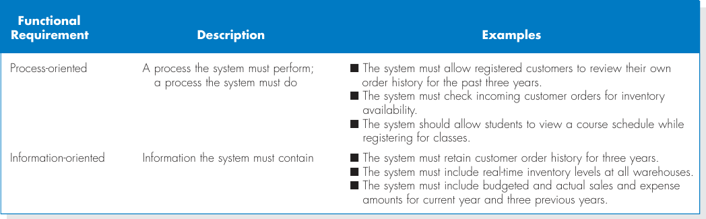
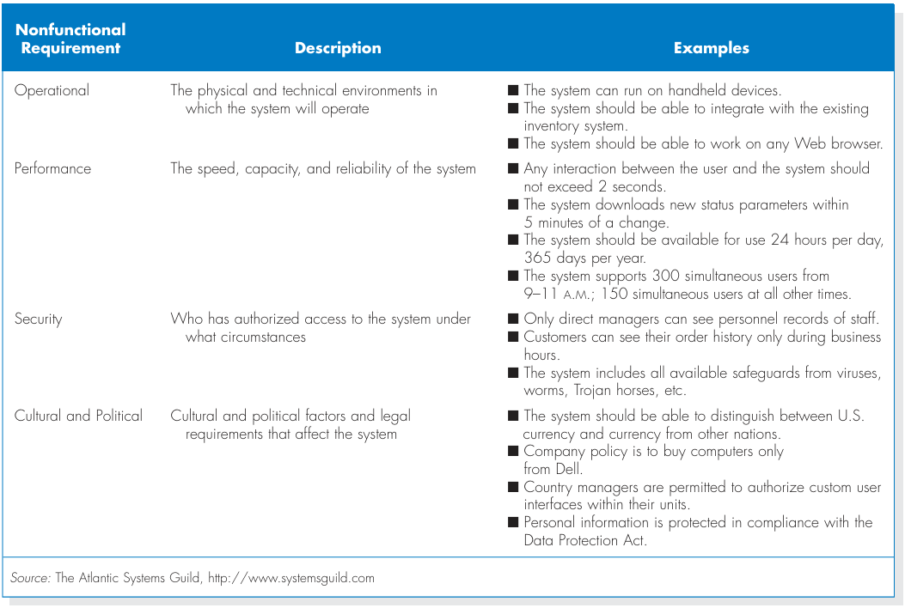

# Chapter 3 - Requirements Determination

## Analysis
- Apply requirements analysis techniques (business process automation, business process improvements, or business process reengineering).
- User requirements gathering techniques (interview, JAD session, questionnaire, document analysis, or observation).
- Develop requirements definition.

## The Analysis Phase
- Analysis refers to breaking a whole into its parts with the intent of understanding the parts' nature, functions, and interrelationships.
- The planning phase deliverables are the key inputs into the analysis phase.
- The basic analysis process involves **three** steps:
  1. Understand the existing situation (the as-is system). 
  2. Identify improvements. 
  3. Define the requirements for the new system (the to-be system).
- The final deliverables of the analysis phase is the **system proposal**.
- It's presented to the approval committee in the form of a system walk-through to explain the system in reasonable detail.
- The deliverables from the analysis phase are the first step in the design of the new system.

## Requirements Determination
- In many ways, determining requirements is the single most critical aspect of the entire SDLC. Although many factors contribute to the failure of systems development projects, failing to determine the correct requirements is a primary cause.
- Therefore, analysts should devote considerable attention to the work performed in the analysis phase.
  - It is here that the major elements of the system first begin to emerge.
- If the requirements are later found to be incorrect or incomplete, ⇒ significant rework may be necessary, adding significant time and cost to the project.
- Requirements determination is performed to transform the system request's high-level statement of business demands and requirements into a more detailed, precise list of what the new system must do (functions, processes, applications, etc...) to provide the needed value (benefits, automation, improvement) to the business organizations.

## What is a Requirement?
- A requirement is a statement of what the system must do or what characteristics it needs to have.
- Requirements describe:
  - What the business needs (business requirements).
  - What the users need to do (user requirements).
  - What the software should do (functional requirements).
  - Characteristics the system should have (non-functional requirements).
  - How the system should be built (system requirements).

### Functional Requirements
  

### Non-Functional Requirements
  

### The Process of Determining Requirements
- Both business and IT perspectives are necessary to determine requirements during the analysis phase.
- The most effective approach is to have both business people and analysts working together to determine requirements.
- The analyst must also consider how best to elicit the requirements from stakeholders.
- This process continues throughout the analysis phase, and the requirement definition evolves over time.
