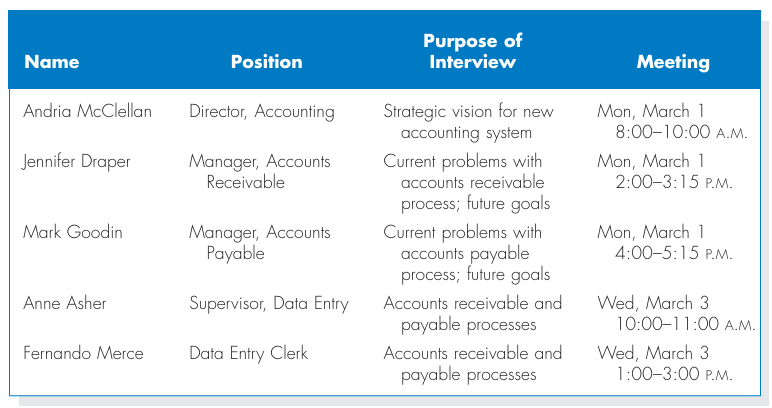
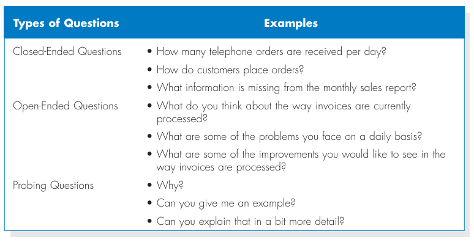
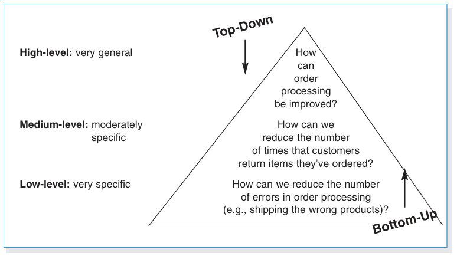
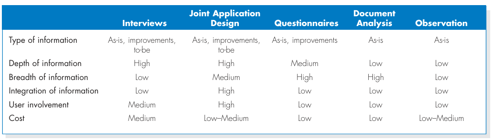
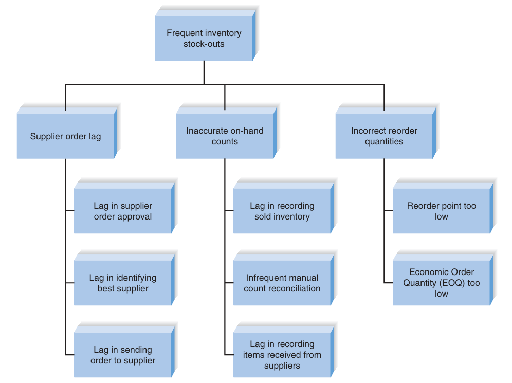

# Chapter 3 - Requirements Determination

## Analysis
- Apply requirements analysis techniques (business process automation, business process improvements, or business process reengineering).
- User requirements gathering techniques (interview, JAD session, questionnaire, document analysis, or observation).
- Develop requirements definition.

## The Analysis Phase
- Analysis refers to breaking a whole into its parts with the intent of understanding the parts' nature, functions, and interrelationships.
- The planning phase deliverables are the key inputs into the analysis phase.
- The basic analysis process involves **three** steps:
  1. Understand the existing situation (the as-is system). 
  2. Identify improvements. 
  3. Define the requirements for the new system (the to-be system).
- The final deliverables of the analysis phase is the **system proposal**.
- It's presented to the approval committee in the form of a system walk-through to explain the system in reasonable detail.
- The deliverables from the analysis phase are the first step in the design of the new system.

## Requirements Determination
- In many ways, determining requirements is the single most critical aspect of the entire SDLC. Although many factors contribute to the failure of systems development projects, failing to determine the correct requirements is a primary cause.
- Therefore, analysts should devote considerable attention to the work performed in the analysis phase.
  - It is here that the major elements of the system first begin to emerge.
- If the requirements are later found to be incorrect or incomplete, ⇒ significant rework may be necessary, adding significant time and cost to the project.
- Requirements determination is performed to transform the system request's high-level statement of business demands and requirements into a more detailed, precise list of what the new system must do (functions, processes, applications, etc...) to provide the needed value (benefits, automation, improvement) to the business organizations.

## What is a Requirement?
- A requirement is a statement of what the system must do or what characteristics it needs to have.
- Requirements describe:
  - What the business needs (business requirements).
  - What the users need to do (user requirements).
  - What the software should do (functional requirements).
  - Characteristics the system should have (non-functional requirements).
  - How the system should be built (system requirements).

### Functional Requirements
  

### Non-Functional Requirements
  

### The Process of Determining Requirements
- Both business and IT perspectives are necessary to determine requirements during the analysis phase.
- The most effective approach is to have both business people and analysts working together to determine requirements.
- The analyst must also consider how best to elicit the requirements from stakeholders.
- This process continues throughout the analysis phase, and the requirement definition evolves over time.

### Requirements Elicitation Techniques
- Requirements Elicitation in Practice:
  - The analyst should recognize that important side effects of the process of determining requirements include:
    1. Building political support for the project.
    2. and Establishing trust between the project team and the users.
  - The analyst should carefully determine Who is included in the process of determining requirements.

#### Interviews
- The most commonly used requirements elicitation technique.
- **Basic steps**:
  1. Selecting interviewees.
     - Including people at different levels of the business organizations.
       - Managers, users, staff, business device technicians.
       - Administrative financial authority.
       - Other key stakeholders.
     - 
  2. Designing interview questions.
     - 
     - Unstructured interview:
       - for a broad and roughly defined set of information.
     - Structured interview:
       - for very specific information.
     - Top-down vs. bottom-up interview:
       - 
  3. Preparing for the interview.
     - Prepare a general interview plan.
     - Confirm areas of knowledge.
     - Set priorities in case of time shortage.
     - Prepare the interviewee:
       - Schedule.
       - Inform of reason for the interview.
       - Inform of discussion areas.
  4. Conducting the interview.
     - Appear to be professional and unbiased.
     - Record all information.
     - Separate facts from opinions.
     - Be sure you understand the issues that are discussed.
     - Give interviewee time to ask questions, and briefly explain what will happen next.
     - Interpersonal skills:
       - Analysts should enhance their interpersonal skills to improve the interviewing success.
  5. Post-interview follow-up.
     - After the interview, the analyst needs to prepare an interview report.
     - The report includes interview notes.
     - The report is sent to interviewee with a request to read it carefully and inform the analyst of clarification and updates.

#### Joint Application Development (JAD)
- JAD is an information gathering technique that allows the project team, users, and management to work together to identify requirements for the system.
- It can reduce scope creep by 50%.
- JAD is a structure process in which 10 to 20 users meet under the direction and control of a facilitator skilled in JAD techniques.
- Selecting JAD participants in the same way as selecting interview participants.
- Facilitator:
  - Expert in JAD and e-JAD techniques.
  - In many cases, the JAD facilitator is a consultant external to the business organization.
- Designing and preparing for JAD sessions:
  - JAD sessions can run from a half-day to several weeks depending upon the size and scope of the project.
  - JAD's success depends upon a careful plan.
  - Most JAD sessions are designed to collect specific information from users.
  - It's important to prepare the analyst and participants for the JAD session.
- Conducting the JAD session:
  - Most JAD sessions follow formal agenda and ground rules.
  - The JAD facilitator performs three key functions:
    - Keep the session on track, following the agenda.
    - Help the group understand the technical terms and terminology.
    - Record group's input on a public display area.
  - The facilitator must remain neutral at all the time and help the group through the process.
- Post-JAD follow-up:
  - Post-session report is prepared and circulated among session attendees.
  - The report should be completed approximately a week to two after the JAD session.

#### Questionnaires
- A questionnaire is a set of written questions for collecting information from individuals.
- Selecting participants
  - using a sample of people who are representative of the entire group.
- Designing the questionnaire
  - following good practice guidelines.
  - Good questionnaire design
    - Begin with nonthreatening and interesting questions.
    - Group items into logically coherent sections.
    - Don't put important items at the very end of the questionnaire.
    - Don't crowd a page with too many items.
    - Avoid abbreviations.
    - Avoid biased or suggestive items or terms.
    - Number questions to avoid confusion.
    - Pretest the questionnaire to identify confusing questions.
    - Provide anonymity ro respondents.
- Administering the questionnaire
  - improving the response rates.
- Questionnaire follow-up
  - developing a report.

#### Documents Analysis
- Documents analysis is used to understand the as-is system.
- Forms, reports, policy manuals, organization charts describe the formal system that the business organization uses.
- The "real" or informal system differs from the formal one, and reveals what needs to be changed.
- The indication that the system needs to be changed is when users create new forms or make changes to the existing forms/reports. Such changes clearly demonstrate the need for improvements to existing systems.
- Thus, it's useful to review both blank and completed forms to identify these deviations. Likewise, when users access multiple reports to satisfy their information needs, it's a clear sign that new information or new information formats are necessary.

#### Observation Method
- Observation is the act of watching processes being performed.
- It's a powerful tool to gain insight into the as-is system, and to check the validity of information gathered from other sources.
- Nonetheless, people tend to be extremely careful in their behaviors when they are being watched.

#### Selecting the Appropriate Technique
1. Type of information. 
2. Depth of information. 
3. Breadth of information. 
4. Integration of information. 
5. User involvement. 
6. Cost.

#### Comparison of Requirements Elicitation Techniques
- 

### Requirements Analysis Strategies
- Problem analysis:
  - Asking users to identify problems and solutions.
  - Improvements from problem analysis tend to be small and incremental.
  - This type of improvement often is very effective at improving a system's efficiency or ease of use; however, it provides minor improvements in business value.
- Root cause analysis:
  - It focuses on problems first rather than solutions.
  - 
- Duration analysis:
  - It requires a detailed examination of the amount of time it takes to perform each process in the as-is system.
  - Compare the total time of complete basic steps and the total time for the overall process — a significant difference indicates that the process is badly fragmented.
  - Potential solutions:
    - Process integration.
    - Parallelization.
- Activity-based costing:
  - It examines the cost of each major process or step in a business process.
  - Both direct and indirect costs are considered.
  - The analysts identify the most costly steps and focus improvement efforts on them.
- Informal benchmarking:
  - It refers to studying how other organizations perform a business process.
  - It's common for "customer-facing" processes.
  - The analysts visit other organizations as customers to watch how the business process is performed.
- Outcome analysis:
  - It focuses on understanding fundamental outcomes that provide value to customers.
  - Think what the business organizations could enable the customer to do.
- Technology analysis:
  - It involves two steps:
    1. The analysts and managers list important and interesting technologies.
    2. Then, the group identifies how every technology might be applied to the business and how the business would benefit.
- Activity elimination:
  - The analysts and managers work together to identify:
    - how the organization could eliminate every activity in the business process.
    - how the function could operate without it.
    - what effects are likely to occur.
- Comparing analysis strategies:
  - Each of the requirement analysis strategies has its own purpose.
  - No one strategy is inherently better than others.
  - The requirement analysis strategy should be chosen to fit the nature of the project.
